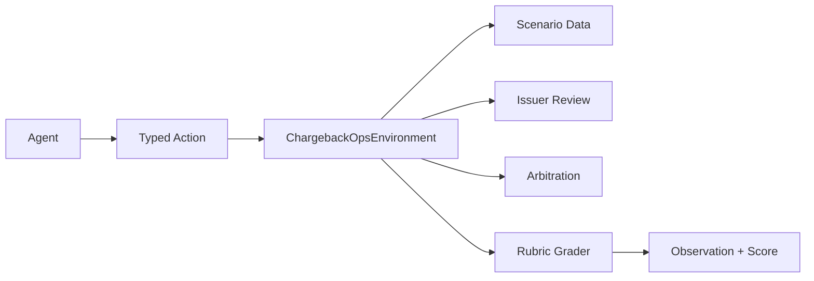
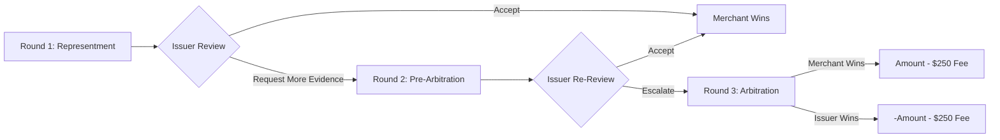

# ChargebackOps: Teaching LLM Agents to Fight Credit Card Disputes

**Hugging Face Space:** https://huggingface.co/spaces/mitudrudutta/ChargeBackOps  
**GitHub Repository:** https://github.com/MitudruDutta/chargebackops

A customer disputes a card payment.

The merchant has a deadline. Evidence is scattered across order logs, payment records, shipping scans, support chats, refund ledgers, and fraud-risk systems.

Some evidence helps. Some evidence hurts. The agent can fight, refund, concede, or escalate. But arbitration costs a fixed **$250**.

So the real question is not simply:

> Can an LLM answer questions about chargebacks?

The better question is:

> Can an LLM agent make evidence-backed, cost-aware decisions in a real operational workflow?

That is the idea behind **ChargebackOps**: an OpenEnv environment for training and evaluating LLM agents on merchant-side chargeback operations.

---

## The Problem: Chargebacks Are Not One-Step Decisions

When a customer disputes a transaction, the merchant can lose the transaction amount immediately. To recover the money, the merchant must submit a **representment packet** before a strict deadline.

A human analyst needs to answer several questions:

- Is this case worth contesting?
- Which internal system should be checked first?
- Is the shipping proof enough?
- Does the fraud signal help or hurt?
- Should we issue a refund instead?
- If the issuer rejects us, should we escalate to arbitration?

This is why chargebacks are a useful environment for agent training. They combine:

- partial observability,
- tool use,
- evidence selection,
- deadlines,
- multi-round review,
- and economic tradeoffs.

Most benchmarks test whether an LLM can produce the right answer. ChargebackOps tests whether an LLM can make the right sequence of decisions.

---

## What ChargebackOps Is

ChargebackOps is a simulated merchant dispute operations environment built on **OpenEnv**.

The agent receives a structured observation, takes a typed action, and receives the next observation after the environment updates.

The loop is simple:

$$
\text{Observation} \rightarrow \text{Action} \rightarrow \text{State Update} \rightarrow \text{Reward / Score}
$$

The workflow is not simple.

The agent must triage cases, query internal systems, collect evidence, avoid harmful artifacts, submit representment packets, handle issuer responses, and decide whether arbitration is worth the fee.

---

## What the Agent Can Do

The agent cannot act with free-form text. It must choose from a typed action space.

### Round 1: Representment

- `select_case`
- `inspect_case`
- `query_system`
- `retrieve_policy`
- `add_evidence`
- `remove_evidence`
- `set_strategy`
- `submit_representment`
- `resolve_case`

### Round 2 and 3: Pre-Arbitration and Arbitration

- `respond_to_pre_arb`
- `escalate_to_arbitration`
- `accept_arbitration_loss`

### Long-Horizon Backlog Management

- `wait_for_updates`

The six merchant systems are:

- `orders`
- `payment`
- `shipping`
- `support`
- `refunds`
- `risk`

This makes the environment closer to a real back-office workflow than a static prompt benchmark.

---

## A Simple Example

Imagine a `goods_not_received` dispute.

The customer says:

> I never received the product.

A weak agent might submit immediately with no evidence.

A better agent does this:

1. Select the case.
2. Inspect the dispute.
3. Query `orders`.
4. Query `shipping`.
5. Attach order confirmation and delivery scan.
6. Set strategy to `contest`.
7. Submit representment.
8. Let the issuer review the packet.

That is a complete evidence-backed operational path.

---

## Architecture



The environment has five main layers:

1. **Interface layer** — Pydantic/OpenEnv models define actions, observations, state, and reports.
2. **Environment core** — `ChargebackOpsEnvironment` runs `reset`, `step`, delayed events, deadlines, issuer review, arbitration, and final grading.
3. **Scenario layer** — cases, evidence, tasks, generated tasks, and runtime `CaseProgress`.
4. **Issuer/arbitration layer** — scripted issuer review and deterministic arbitration economics.
5. **Evaluation layer** — an OpenEnv rubric tree that produces transparent case and episode scores.

---

## Multi-Round Dispute Lifecycle



Arbitration is where the environment becomes especially interesting.

Both sides pay a fixed **$250** fee.

If the merchant wins arbitration:

$$
\text{merchant\_net\_pnl} = \text{amount} - 250
$$

If the merchant loses arbitration:

$$
\text{merchant\_net\_pnl} = -\text{amount} - 250
$$

So escalation is rational only when:

$$
P(\text{win}) \times \text{amount} > 250
$$

This single inequality changes the behavior we want from the agent. The best policy is not “always fight.” The best policy is to fight when the expected value is positive.

---

## The Hardest Task: Monthly Backlog Marathon

The flagship task is:

```text
monthly_dispute_backlog_marathon
```

It includes:

- 12 cases,
- 60 steps,
- wave-based case arrivals,
- delayed evidence,
- delayed issuer reviews,
- multiple open disputes,
- and arbitration tradeoffs.

This task tests memory, prioritization, and portfolio-level reasoning.

The agent has to decide not only what to do, but what to do **now**.

---

## Scoring: An 8-Dimensional Rubric

ChargebackOps uses a composable OpenEnv rubric instead of one monolithic reward.


| Dimension | Weight | What it measures |
|---|---:|---|
| Strategy correctness | 0.20 | Did the agent choose the right strategy? |
| Evidence quality | 0.15 | Did it attach useful evidence and avoid harmful evidence? |
| Packet validity | 0.10 | Was the packet complete and clean? |
| Deadline compliance | 0.10 | Was the case handled on time? |
| Efficiency | 0.10 | Did the agent avoid wasted actions? |
| Outcome quality | 0.10 | Did the final result match the correct resolution? |
| Note quality | 0.05 | Was the representment note coherent? |
| Escalation ROI | 0.20 | Was arbitration economically rational? |

The case score can be written as:

$$
\begin{aligned}
S_{case} ={}& 0.20S_{strategy}
+ 0.15S_{evidence}
+ 0.10S_{packet}
+ 0.10S_{deadline} \\
&+ 0.10S_{efficiency}
+ 0.10S_{outcome}
+ 0.05S_{note}
+ 0.20S_{roi}
\end{aligned}
$$

The environment also includes a deadline gate. If a case is truly abandoned past deadline, it can be hard-zeroed:

$$
S_{case}^{final} =
\begin{cases}
0, & \text{if abandoned past deadline} \\
S_{case}, & \text{otherwise}
\end{cases}
$$

The final episode score is a weighted average across cases:

$$
S_{episode} = \frac{\sum_i w_i S_i}{\sum_i w_i}
$$

This gives the environment a useful property: results are not just scores, they are diagnosable.

---

## Does the Environment Separate Good and Bad Policies?

Yes.

I tested four scripted policies across the headline catalog and multi-seed grid.


| Policy | Headline avg | Multi-seed avg | Behavior |
|---|---:|---:|---|
| `naive` | 0.000 | 0.000 | Submit empty packets immediately |
| `concede_all` | 0.444 | 0.445 | Always accept the chargeback |
| `escalate_all` | 0.767 | 0.768 | Always contest and always escalate |
| `heuristic` | **0.813** | 0.763 | EV-rational rule-based policy |

The headline discrimination delta is:

$$
\Delta = S_{heuristic} - S_{naive} = 0.813 - 0.000 = 0.813
$$

That means the benchmark clearly separates weak shortcut behavior from stronger operational behavior.

The naive policy collapses. The concede-all policy gets partial credit but misses positive-EV contests. The escalate-all policy looks strong but pays unnecessary arbitration costs. The heuristic wins because it balances evidence, deadline, and ROI.

---

## Training Pipeline

The training setup uses:

```text
Qwen/Qwen2.5-3B-Instruct + fp16 LoRA
```

on a single T4.

The training pipeline has two phases.

### Phase A: Supervised Fine-Tuning

The SFT phase teaches the model the typed-action interface and basic dispute workflow behavior.

- 4,000 heuristic-generated prompt/action pairs.
- LoRA rank 16.
- 150 SFT steps.

### Phase B: GRPO

The GRPO phase uses outcome reward and format reward.

The outcome reward is based on terminal merchant P&L:

$$
R_{outcome} = \text{normalize}(\text{terminal merchant P\&L})
$$

The format reward provides a small signal for structured output:

$$
R_{format} =
\begin{cases}
+0.05, & \text{if output is parseable JSON} \\
-0.10, & \text{if output is not parseable JSON}
\end{cases}
$$

The combined reward is:

$$
R = R_{outcome} + R_{format}
$$

The reason for using outcome reward is simple: the goal is not just to imitate a heuristic. The goal is to optimize business outcome.

---

## Training Results


The clearest legitimate learning signal is the SFT checkpoint.

| Checkpoint | Overall score |
|---|---:|
| Untrained Qwen2.5-3B base | 0.456 |
| SFT checkpoint | **0.536** |

The absolute improvement is:

$$
\Delta_{SFT} = 0.536 - 0.456 = 0.080
$$

The relative improvement is:

$$
\frac{0.536 - 0.456}{0.456} \times 100 \approx 17.54\% \approx 18\%
$$

The SFT model learned the interface and improved over the base model.

---

## Per-Difficulty Behavior


The easy and medium cases improve most clearly after SFT.

The hard and nightmare tasks remain difficult because they require:

- multi-case triage,
- delayed evidence tracking,
- deadline-aware prioritization,
- harmful evidence filtering,
- and portfolio-level planning.

That is exactly what makes the environment useful. The easy cases teach the interface. The harder cases test whether an agent can manage operational complexity.

---

## A Useful Training Surprise

The GRPO phase produced an important lesson.

Later GRPO checkpoints appeared to match the heuristic baseline exactly. At first, that looked like success.

But diagnostic rollouts showed the model was emitting:

```json
{"action_type": "accept_case", "case_id": "CB-E1"}
```

`accept_case` is not a valid environment action.

The closest valid actions are:

- `accept_chargeback`
- `accept_arbitration_loss`
- `select_case`

The invalid action parsed as JSON but failed action validation. Because the evaluation helper fell back to the heuristic on invalid model output, the final score reflected heuristic behavior rather than trained-model behavior.


This produced a clear rule for typed-action RL environments:

> A model should not get credit for a fallback policy’s work.

A corrected evaluation can penalize invalid actions:

$$
S_{eval}^{corrected} = S_{rubric} - \lambda \cdot N_{invalid}
$$

where:

- $S_{rubric}$ is the original rubric score,
- $N_{invalid}$ is the number of invalid actions,
- and $\lambda$ is the penalty per invalid action.

This is a side lesson, not the core product. But it is an important one: typed-action training needs strict attribution.

---

## Why This Matters Beyond Chargebacks

ChargebackOps is about more than disputes.

The same structure appears in many real-world workflows:

- insurance claims,
- tax audits,
- content-moderation appeals,
- procurement disputes,
- patent disputes,
- compliance reviews.

These workflows share the same pattern:

1. Evidence is scattered.
2. Deadlines matter.
3. Escalation has a cost.
4. Bad evidence can hurt.
5. The correct action depends on both probability and value.

ChargebackOps turns that pattern into a benchmark.

---

## How to Try It

Open the Hugging Face Space:

https://huggingface.co/spaces/mitudrudutta/ChargeBackOps

Or run locally:

```bash
git clone https://github.com/MitudruDutta/chargebackops.git
cd chargebackops
pip install -e ".[dev]"
pytest -q tests
openenv validate .
uvicorn server.app:app --host 0.0.0.0 --port 8000
```

Then open:

```text
http://localhost:8000/docs
http://localhost:8000/demo
```

A simple demo path is:

1. Start `goods_not_received_easy`.
2. Select the dispute case.
3. Query `orders`.
4. Query `shipping`.
5. Attach order and delivery evidence.
6. Set strategy to `contest`.
7. Submit representment.
8. Show issuer acceptance.
9. Show the final grader report.

---

## What Comes Next

The next improvements are clear:

- stricter invalid-action penalties,
- fallback-free trained-policy evaluation,
- deeper Visa/Mastercard rule modeling,
- more stochastic merchant-system behavior,
- adaptive or learned issuer opponents,
- richer ISO and Stripe data adapters,
- and a cleaner product dashboard for dispute workflows.

---

## Conclusion

ChargebackOps is a reproducible OpenEnv benchmark for long-horizon, cost-sensitive, evidence-driven agent behavior.

It does not ask an LLM to merely summarize documents. It asks the agent to act.

The agent must gather evidence, avoid harmful signals, handle deadlines, respond to issuer pushback, and decide whether arbitration is worth the fee.

In short:

> ChargebackOps is not about teaching an agent to click buttons. It is about teaching an agent to make evidence-backed decisions when every step has a cost.

Try it here:

https://huggingface.co/spaces/mitudrudutta/ChargeBackOps
