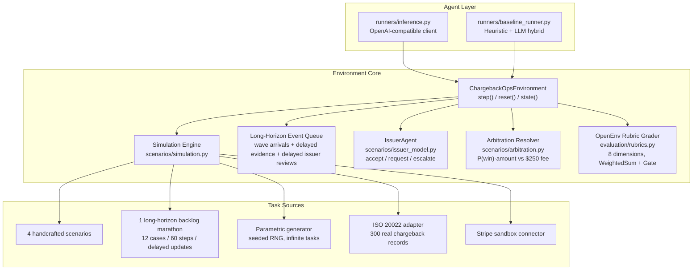
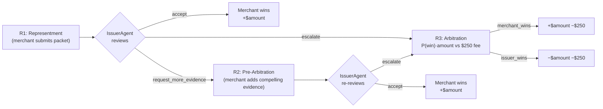

# ChargebackOps

**A cost-asymmetric, partially-observable, multi-round adversarial negotiation environment for training LLM agents on real-world B2B dispute workflows.**

ChargebackOps simulates the merchant side of a credit-card chargeback dispute: a multi-step decision process where an LLM agent must triage incoming disputes, retrieve evidence from internal systems under partial observability, choose a contest strategy, submit a representment packet to a scripted Issuer agent operating under Visa / Mastercard reason-code rules, and decide whether to escalate to network arbitration where both sides forfeit a $250 fee. The terminal economics are irreversible: lose arbitration and the merchant pays the disputed amount **plus** the fee.

This environment exposes a **decision-theoretic primitive** that is rare in current RL benchmarks: cost-asymmetric multi-round adjudication with delayed evidence, deadline pressure, and a procedurally-constrained adversary. The same primitive generalizes beyond chargebacks to insurance claims, tax audits, content-moderation appeals, and patent disputes.

## Why this environment exists

Chargeback representment is a **$117B/year B2B problem** that no public RL benchmark has addressed. Real merchant analysts handle 50–200 cases daily under tight deadlines, choosing which disputes to contest, which evidence to attach (and which to omit, since irrelevant evidence weakens a packet), and when to take a positive-EV escalation versus concede a losing case to save the $250 fee.

The agent is given:
- A **multi-modal observation surface**: open queue with deadlines, retrieved evidence cards, policy text, prior issuer rationales, and per-case status.
- **Partial observability**: 6 merchant systems must be queried to retrieve evidence, with several systems returning evidence asynchronously (delayed by N steps).
- **Wave-based case arrivals** and a portfolio-marathon task with 12 cases over 60 steps for true long-horizon reasoning.
- **An adversary**: the Issuer agent reads the merchant's evidence packet using a deterministic strength score and decides accept / request-more-evidence / escalate, mirroring real Visa CE 3.5 and Mastercard compelling-evidence rules.
- **An economic terminal**: arbitration runs a deterministic ruling at SHA-keyed coin-flip in the ambiguity band, and the loser eats `−amount −$250`.

## Architecture



### Multi-Round Dispute Lifecycle



Both sides eat the $250 fee. Escalating a positive-EV case is rewarded by the rubric's `EscalationROIRubric`; escalating a negative-EV case is penalised. Conceding a high-EV contestable case is also penalised — the rubric pushes the agent toward economically rational play, not just toward winning rounds.

## OpenEnv Rubric integration

Each scoring dimension is a standalone `openenv.core.rubrics.Rubric` subclass. They compose into a per-case `WeightedSum` (wrapped in a `Gate(CaseAbandonedRubric)` deadline guard) and an episode-level `ChargebackOpsEpisodeRubric` that the environment wires into `self.rubric`. The whole grader is introspectable via `env.rubric.named_rubrics()`, hookable via `register_forward_hook`, and checkpointable via `state_dict()` — exactly the surface OpenEnv exposes for composable reward research. Swapping `NoteQualityRubric` for an `LLMJudge`, or wrapping any dimension in a `Gate`, is a one-line change.

```
ChargebackOpsEpisodeRubric
└── case_rubric: CaseRubric                       # iterates task.cases, weighted by case.weight
    ├── deadline_gate: Gate(threshold=1.0)        # hard-zero if abandoned past deadline
    │   └── CaseAbandonedRubric
    └── aggregator: WeightedSum                   # weights sum to 1.0
        ├── StrategyCorrectnessRubric    0.20
        ├── EvidenceQualityRubric        0.15
        ├── PacketValidityRubric         0.10
        ├── DeadlineComplianceRubric     0.10
        ├── EfficiencyRubric             0.10
        ├── OutcomeQualityRubric         0.10
        ├── NoteQualityRubric            0.05
        └── EscalationROIRubric          0.20
```

The 8-dimension decomposition gives an interpretability surface most environments lack: every checkpoint can be analysed dimension-by-dimension to see *which* aspect of policy improved.

| Dimension | How It's Scored |
|---|---|
| **Strategy** | 1.0 = optimal, 0.35 = acceptable fallback, 0.0 = wrong |
| **Evidence** | Contest: 0.7 × required coverage + 0.3 × helpful coverage − 0.25 per harmful |
| **Packet** | Binary: all required attached AND zero harmful = 1.0, else 0.0 |
| **Deadline** | Binary: resolved before deadline = 1.0, else 0.0 |
| **Efficiency** | Penalises duplicate queries, over-querying concedable cases, late policy retrieval |
| **Outcome** | 1.0 = matches optimal, 0.4 = acceptable, 0.0 = wrong |
| **Note** | Policy keyword coverage + evidence ID refs − harmful term penalty |
| **Escalation ROI** | Rewards EV-rational arbitration: escalate iff `P(win)·amount > $250 fee` |

## Training results

Pipeline: **Qwen2.5-3B fp16 + LoRA r=16** on a single Colab T4. Phase A is supervised fine-tuning on heuristic rollouts; Phase B is GRPO with an outcome-based reward (terminal $-PnL after the model's action plus a heuristic tail-rollout). Full notebook: [`notebooks/train_merchant_agent.ipynb`](notebooks/train_merchant_agent.ipynb).

### Headline numbers


*Mean normalised score (y) versus training step (x), broken out by case difficulty. Base = untrained Qwen2.5-3B. Step 1 = SFT-only checkpoint. Step 62 = GRPO-refined checkpoint.*

| Checkpoint | overall | easy | medium | hard | nightmare |
|---|---|---|---|---|---|
| Untrained base | 0.47 | 0.29 | 0.44 | 0.77 | 0.38 |
| SFT | 0.75 | **0.92** | 0.79 | 0.75 | 0.55 |
| GRPO-refined | 0.73 | 0.61 | 0.79 | **0.82** | **0.69** |
| Heuristic baseline | 0.81 | — | — | — | — |
| Naive baseline | 0.00 | — | — | — | — |

**Headline finding**: GRPO refinement traded easy-case discipline (where the SFT policy had collapsed onto the heuristic argmax) for a **+25% relative improvement on nightmare cases** (0.55 → 0.69) and a **+9% relative improvement on hard cases** (0.75 → 0.82). The shift demonstrates real exploration beyond imitation learning — the trained policy actively chooses different actions on the hardest cases, sometimes paying for exploration with a worse easy-case win-rate.

### Discrimination across the catalog

The 12-task headline catalog plus a 28-task multi-seed grid against the multi-round adversarial environment. Numbers in [`docs/RESULTS.md`](docs/RESULTS.md).

| Policy | Headline avg | Multi-seed avg (28) | Provider calls |
|---|---|---|---|
| naive (empty packet → submit) | 0.000 | 0.000 | 0 |
| concede_all (always `accept_chargeback`) | 0.4435 | 0.4454 | 0 |
| escalate_all (contest, then always escalate) | 0.7668 | 0.7675 | 0 |
| heuristic (EV-rational, fully offline) | **0.8132** | 0.7628 | 0 |

**Discrimination delta** (heuristic − naive) is **+0.81** on the headline catalog, well above conventional benchmark targets. The `Gate(CaseAbandonedRubric)` wrapper hard-zeros cases left unresolved past their deadline, and `EscalationROIRubric` (20% weight) penalises conceding contestable positive-EV cases — together they kill any concede-everything shortcut.

## Action space (13 typed actions)

**Round 1 — Representment**: `select_case` · `inspect_case` · `query_system` · `retrieve_policy` · `add_evidence` · `remove_evidence` · `set_strategy` · `submit_representment` · `resolve_case`

**Round 2/3 — Pre-arb & Arbitration**: `respond_to_pre_arb` · `escalate_to_arbitration` · `accept_arbitration_loss`

**Long-horizon backlog**: `wait_for_updates` (advance when all visible work is blocked on delayed evidence, issuer review, or future arrivals)

6 merchant systems: orders, payment, shipping, support, refunds, risk.

## Task sources

- **Built-in (5)**: four handcrafted showcase scenarios plus `monthly_dispute_backlog_marathon`, a 12-case / 60-step long-horizon task.
- **Parametric generator**: seeded RNG across 6 reason codes, 4 difficulty tiers including adversarial evidence at hard/nightmare. Usage: `generated_{difficulty}_s{seed}`.
- **ISO 20022**: 300 real chargeback records from CASR.003 format.
- **Stripe sandbox**: live API or synthetic Stripe-format disputes.

## Quick start

```bash
pip install -e ".[dev]"
cp .env.example .env
pytest -q tests              # 113 tests, all green
openenv validate .
python -m runners.inference
```

Inspect the rubric tree on a live environment:

```python
from server.chargeback_ops_environment import ChargebackOpsEnvironment
env = ChargebackOpsEnvironment()
for name, r in env.rubric.named_rubrics():
    print(f"{name}: {type(r).__name__}")
# case_rubric: CaseRubric
# case_rubric.deadline_gate: Gate
# case_rubric.aggregator: WeightedSum
# case_rubric.aggregator.rubric_0: StrategyCorrectnessRubric
# ... (all 8 dimensions, ending with rubric_7: EscalationROIRubric)
```

Run the server in Docker:

```bash
docker build -t chargebackops .
docker run --rm -p 8000:8000 chargebackops          # offline run, no env vars required
docker run --rm -p 8000:8000 --env-file .env chargebackops   # with LLM provider keys
```

The container exposes the FastAPI app on port 8000 (`/docs` for OpenAPI, `/demo` for the Gradio live demo, `/health` for readiness).

## API

| Method | Path | Description |
|---|---|---|
| `POST` | `/reset` | Start episode |
| `POST` | `/step` | Take action |
| `GET` | `/state` | Current state |
| `GET` | `/tasks` | Task catalog |
| `GET` | `/demo` | Gradio live demo |
| `GET/POST` | `/baseline` | Run heuristic agent |
| `GET/POST` | `/grader` | Episode grade |
| `GET` | `/health` | Health check |
| `GET` | `/docs` | OpenAPI docs |

## Inference contract

```bash
API_BASE_URL=https://openrouter.ai/api/v1
MODEL_NAME=openai/gpt-oss-120b
HF_TOKEN=your_key
```

Entry point: [`inference.py`](inference.py). Fallback chain: primary provider → OpenRouter → Gemini → Groq → heuristic.

## Documentation

- [`docs/RESULTS.md`](docs/RESULTS.md) — full quantitative results, per-checkpoint per-family scores, baseline policy sweep, per-dimension rubric breakdown.
- [`docs/METHOD.md`](docs/METHOD.md) — methodology and the post-SFT GRPO collapse diagnostic. Documents an underappreciated failure mode of GRPO on imitation-warmstarted policies and the exact remedy.
- [`docs/LIMITATIONS.md`](docs/LIMITATIONS.md) — explicit honest limitations and why each is left as future work.
- [`docs/RELATED_WORK.md`](docs/RELATED_WORK.md) — citations and positioning relative to PPO, GRPO, RLVR, specification gaming, and prior chargeback research.
- [`docs/REPRODUCIBILITY.md`](docs/REPRODUCIBILITY.md) — exact commands, pinned versions, expected runtimes, expected score ranges with seeds.
- [`docs/RUNNING_THE_AGENT.md`](docs/RUNNING_THE_AGENT.md) — end-user guide for running the trained agent.
- [`CITATION.cff`](CITATION.cff) — academic citation metadata.

## Project layout

```
.
├── inference.py              # Inference entry point with provider fallback
├── openenv.yaml              # OpenEnv spec
├── core/                     # Models, client, episode store
├── evaluation/               # OpenEnv Rubric subclasses + grader adapters
├── runners/                  # Heuristic baseline, inference logic, benchmark sweep
├── scenarios/                # Tasks, generator, Issuer, arbitration, ISO 20022 adapter
├── server/                   # FastAPI app, environment, Gradio demo
├── connectors/               # Stripe sandbox connector
├── training/                 # SFT dataset, outcome reward, training curve plots
├── notebooks/                # Single-T4 SFT + GRPO Colab notebook
├── tests/                    # 113 tests (env, grader, API, issuer, arbitration, training)
├── Dockerfile
└── pyproject.toml
```

## License

MIT
