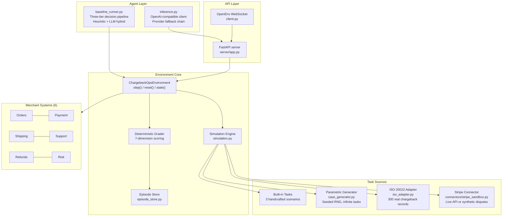
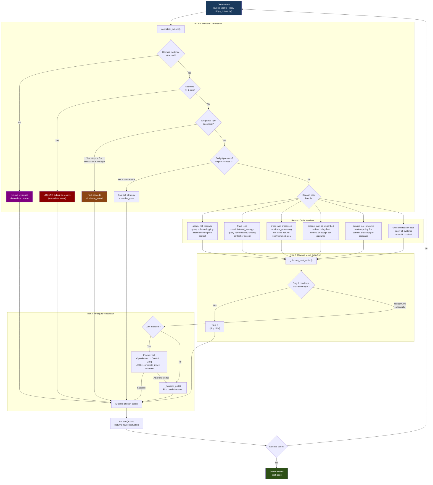
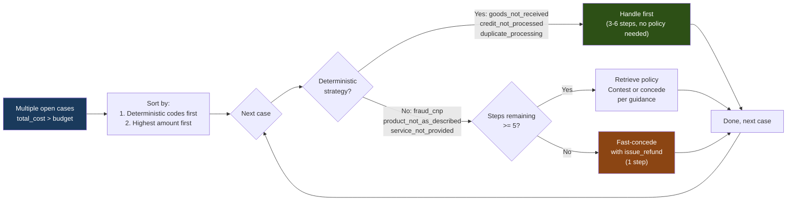
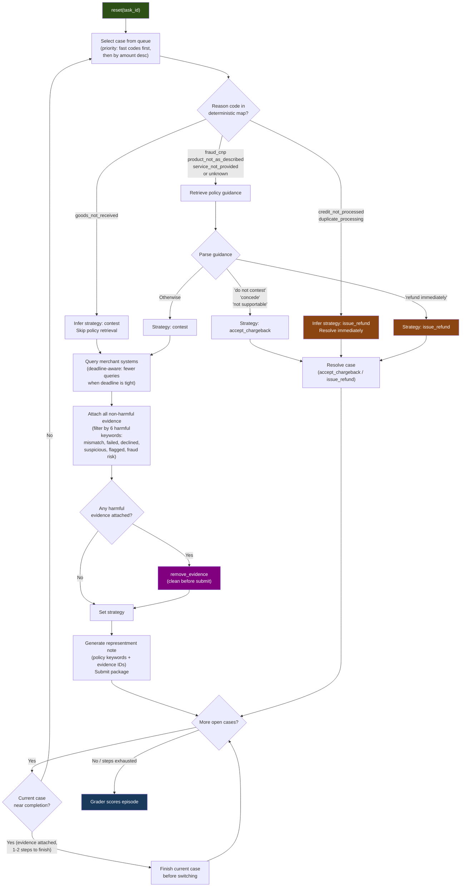
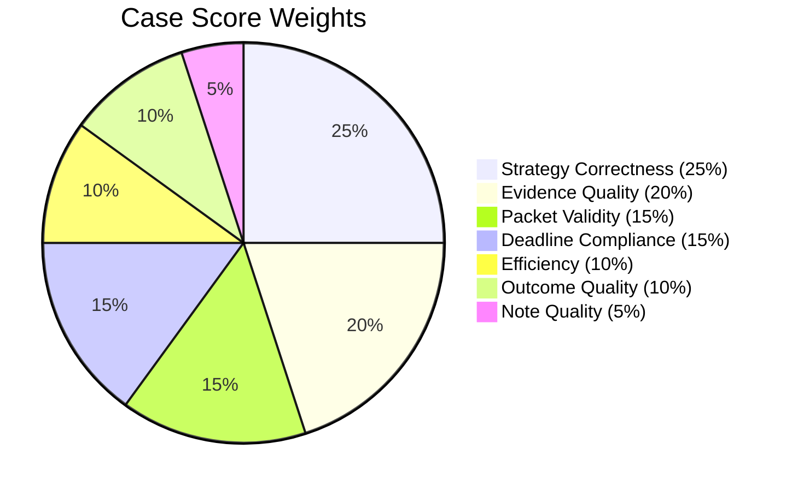
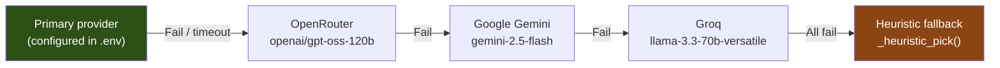

# ChargebackOps


ChargebackOps is an OpenEnv environment for merchant-side chargeback and dispute operations. The agent acts as a dispute analyst: it triages open disputes, retrieves evidence from merchant systems, decides whether to contest or concede, and resolves each case under deadline and step-budget pressure.

The repository is designed for agent evaluation rather than generic chat. It exposes a typed action space, deterministic state transitions, dense reward shaping, and programmatic grading so model behavior can be measured as operational performance.

## Why This Environment Matters

Chargeback dispute handling is a real operations workflow. Analysts must:

- interpret reason codes and response deadlines
- gather evidence from the correct internal systems while avoiding harmful artifacts
- decide whether to contest, accept, or refund
- prioritize multiple disputes by urgency, recoverability, and operational cost

That makes ChargebackOps a good benchmark for tool-using agents. It measures retrieval quality, decision quality, prioritization, and operational restraint in a controlled environment with deterministic scoring.

## System Architecture



## Agent Decision Pipeline

The agent operates a three-tier decision pipeline on every step. Each observation passes through candidate generation, obvious-move detection, and then either LLM or heuristic resolution.



## Case Triage (Multi-Case Scenarios)

When the agent faces multiple open cases with insufficient budget to contest all, it employs a triage strategy:



## Episode Workflow



## Grading System



| Dimension | How It's Scored |
|---|---|
| **Strategy Correctness** | 1.0 = optimal strategy, 0.55 = acceptable fallback, 0.0 = wrong |
| **Evidence Quality** | Contest: 0.7 × (required attached / total required) + 0.3 × (helpful / total helpful) − 0.25 per harmful. Non-contest: 1.0 if clean, 0.7 otherwise |
| **Packet Validity** | Binary: 1.0 if all required evidence attached AND zero harmful, else 0.0 |
| **Deadline Compliance** | Binary: 1.0 if resolved before deadline step, else 0.0 |
| **Efficiency** | 1.0 − (duplicate_queries × 0.1 + submit_attempts × 0.05), min 0.1 |
| **Outcome Quality** | 1.0 = optimal resolution, 0.6 = acceptable, 0.0 = wrong |
| **Note Quality** | Contest only: word substance (20%) + policy keyword coverage (50%) + evidence ID refs (15%) − harmful keyword penalty (15%) |

Each case is weighted by financial impact. Episode score normalizes across all cases to `[0.0, 1.0]`.

## LLM Provider Fallback Chain



## Agent Performance (63 Episodes)

Results from the heuristic agent across built-in and parametric tasks:

| Source | Avg | >= 0.90 | < 0.50 | Min |
|---|---|---|---|---|
| Built-in tasks (3) | 0.933 | 2/3 | 0/3 | 0.865 |
| Parametric easy (20) | 0.980 | 20/20 | 0/20 | 0.958 |
| Parametric medium (20) | 0.868 | 12/20 | 0/20 | 0.624 |
| Parametric hard (20) | 0.722 | 0/20 | 0/20 | 0.559 |

**Overall: 0.861 avg | 54.0% score >= 0.90 | 0.0% score < 0.50**

## Task Sources

### Built-in Scenarios (3 tasks)

| Task ID | Difficulty | Objective |
|---|---|---|
| `goods_not_received_easy` | Easy | Contest a goods-not-received case with delivery proof |
| `fraud_signal_ambiguity` | Medium | Handle CNP fraud with mixed evidence and harmful artifacts |
| `queue_optimization_hard` | Hard | Maximize recovery across a multi-case queue under deadline pressure |

### Parametric Generator (`case_generator.py`)

Generates infinite reproducible tasks from seeded RNG across 6 reason code families. Usage: `generated_{difficulty}_s{seed}` (e.g., `generated_hard_s42`).

### ISO 20022 Real Data (`iso_adapter.py`)

Converts 300 real chargeback records from ISO 20022 CASR.003 format into environment cases. Covers fraud, goods-not-received, duplicate processing, credit-not-processed, product-not-as-described, and service-not-provided disputes.

### Stripe Sandbox (`connectors/stripe_sandbox.py`)

Maps Stripe test-mode dispute objects into environment cases. Supports live API access with `STRIPE_API_KEY` or falls back to synthetic Stripe-format disputes.

## Action Space

| Action | Purpose |
|---|---|
| `select_case` | Focus a case from the dispute queue |
| `inspect_case` | Reveal analyst inspection notes |
| `query_system` | Pull evidence from a merchant system |
| `retrieve_policy` | Get reason-code guidance and required evidence |
| `add_evidence` | Attach retrieved evidence to the representment package |
| `remove_evidence` | Remove evidence (including harmful attachments) |
| `set_strategy` | Choose `contest`, `accept_chargeback`, or `issue_refund` |
| `submit_representment` | Submit a contest package with an optional rationale note |
| `resolve_case` | Close a non-contest case |

## Quick Start

### Install

```bash
uv sync --extra dev
# or
pip install -e ".[dev]"
```

### Configure

```bash
cp .env.example .env
# Edit .env with your provider keys
```

### Validate

```bash
pytest -q tests
openenv validate .
python -m runners.baseline_runner
python -m evaluation.agent_brutal_audit
```

### Run Server

```bash
uvicorn chargeback_ops.server.app:app --host 0.0.0.0 --port 8000
```

### Docker

```bash
docker build -t chargebackops .
docker run --rm -p 8000:8000 --env-file .env chargebackops
```

## API Endpoints

| Method | Path | Description |
|---|---|---|
| `GET` | `/` | Service info |
| `GET` | `/health` | Health check |
| `GET` | `/docs` | Interactive OpenAPI docs |
| `POST` | `/reset` | Start a new episode |
| `POST` | `/step` | Apply an action |
| `GET` | `/state` | Current environment state |
| `GET` | `/tasks` | List available tasks |
| `GET` | `/generate` | Generate parametric tasks |
| `GET/POST` | `/grader` | Fetch latest episode grade |
| `GET/POST` | `/baseline` | Run the heuristic baseline |
| `GET` | `/results` | List all completed episode reports |

## Inference Contract

The required entry point [`inference.py`](inference.py) uses the OpenAI-compatible client with:

```bash
API_BASE_URL=https://openrouter.ai/api/v1
MODEL_NAME=openai/gpt-oss-120b
HF_TOKEN=your_key
```

Supported providers: OpenRouter, OpenAI, Google Gemini, Groq, Anthropic-compatible gateways.

## Hugging Face Deployment

1. Create a new HF Space with **Docker** SDK
2. Push this repository
3. Set secrets in Space Settings: `API_BASE_URL`, `MODEL_NAME`, `HF_TOKEN`
4. Verify: `/health`, `/tasks`, `/baseline`

## Project Layout

```
.
├── inference.py                 # Root entry point (submission contract)
├── openenv.yaml                 # OpenEnv spec
├── core/
│   ├── models.py                # Pydantic action/observation/state models
│   ├── client.py                # OpenEnv WebSocket client
│   └── episode_store.py         # Thread-safe episode report store
├── evaluation/
│   ├── grading.py               # Deterministic 7-dimension grader
│   └── agent_brutal_audit.py    # Comprehensive agent evaluation
├── runners/
│   ├── baseline_runner.py       # Heuristic agent with LLM fallback
│   └── inference.py             # Challenge-compatible inference logic
├── scenarios/
│   ├── simulation.py            # Task definitions and case progress
│   ├── case_generator.py        # Parametric seeded task generator
│   └── iso_adapter.py           # ISO 20022 real data adapter
├── server/
│   ├── app.py                   # FastAPI application
│   └── chargeback_ops_environment.py  # Core environment
├── connectors/
│   └── stripe_sandbox.py        # Stripe test-mode connector
├── tests/
│   ├── test_env.py              # Environment + generator tests
│   ├── test_grader.py           # Grading logic tests
│   ├── test_api.py              # API endpoint tests
│   ├── test_requirements.py     # Problem statement compliance
│   └── test_agent_audit.py      # Audit validation tests
├── Dockerfile                   # Production container
├── pyproject.toml               # Package config
└── .env.example                 # Environment variable template
```
