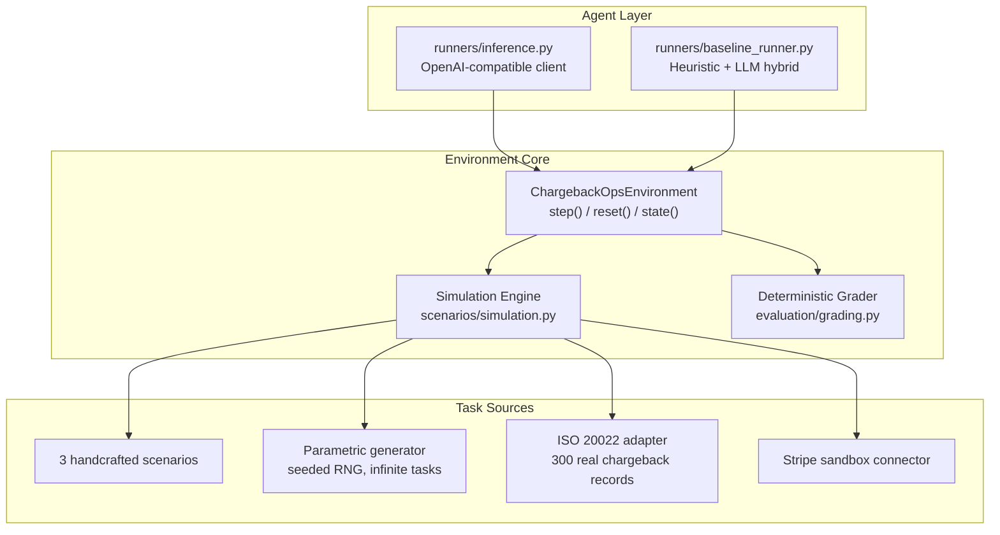
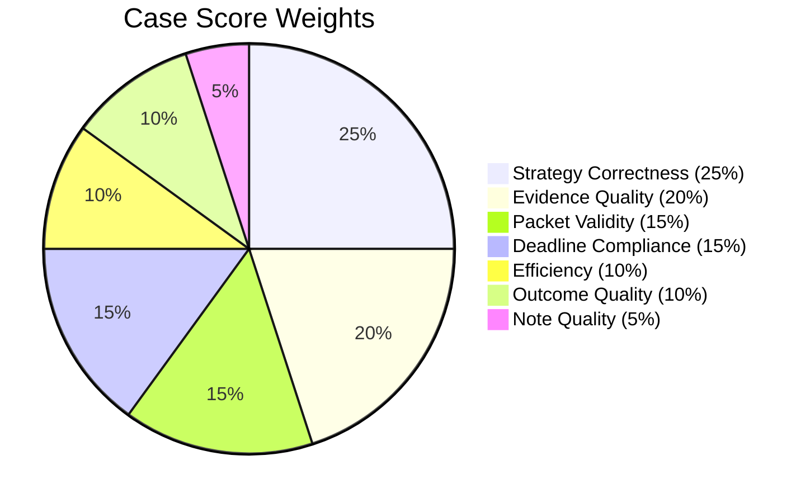

# ChargebackOps

An OpenEnv environment that simulates merchant-side chargeback dispute operations.

Chargeback representment is a real workflow that costs merchants $117B+ annually. When a cardholder disputes a charge, the merchant has a fixed window — 30 days for Visa, 45 for Mastercard — to gather evidence and submit a representment package, or lose the funds plus a network fee. Real analysts handle 50-200 cases daily, triaging by urgency, querying internal systems, filtering out evidence that would hurt their case, and deciding whether to contest or concede. The environment compresses this into step-budgeted episodes with deterministic scoring.

Each case carries real card network metadata: Visa reason code 13.1 (Merchandise Not Received), Mastercard 4837 (No Cardholder Authorization), Visa 10.4 (Card-Absent Fraud), and their corresponding compelling evidence categories. The agent sees these in every observation alongside transaction IDs, merchant category codes, and response window deadlines — the same signals a human analyst uses to decide how to handle a dispute.

The HF Space exposes a live demo at `/demo` for step-by-step episode playback with grading output.

## Architecture



## Grading

7-dimension deterministic grader, weighted per case by financial impact:



| Dimension | How It's Scored |
|---|---|
| **Strategy** | 1.0 = optimal, 0.35 = acceptable fallback, 0.0 = wrong |
| **Evidence** | Contest: 0.7 x required coverage + 0.3 x helpful coverage - 0.25 per harmful |
| **Packet** | Binary: all required attached AND zero harmful = 1.0, else 0.0 |
| **Deadline** | Binary: resolved before deadline = 1.0, else 0.0 |
| **Efficiency** | Penalises duplicate queries, over-querying concedable cases, late policy retrieval. Rewards early correct concessions |
| **Outcome** | 1.0 = matches optimal, 0.4 = acceptable, 0.0 = wrong |
| **Note** | Policy keyword coverage + evidence ID refs - harmful term penalty |

## Benchmark Results

10-task benchmark (3 showcase + 7 seeded holdout), heuristic+LLM agent:

| Difficulty | Tasks | Avg Score | Notes |
|---|---|---|---|
| Easy | 2 | 0.963 | Near-perfect |
| Medium | 3 | 0.518 | Struggles with ambiguous fraud |
| Hard | 3 | 0.686 | Adversarial evidence traps |
| Nightmare | 2 | 0.474 | Step budget exhaustion |
| **Overall** | **10** | **0.648** | **0.96 to 0.47 curve** |

Heuristic vs naive (blind `issue_refund`) gap: **+0.26 average**, **+0.68 on contestable cases**.

## Action Space (9 typed actions)

`select_case` · `inspect_case` · `query_system` · `retrieve_policy` · `add_evidence` · `remove_evidence` · `set_strategy` · `submit_representment` · `resolve_case`

6 merchant systems: orders, payment, shipping, support, refunds, risk.

## Task Sources

- **Built-in** (3): hand-crafted showcase scenarios
- **Parametric generator**: seeded RNG across 6 reason codes, 4 difficulty tiers including adversarial evidence at hard/nightmare. Usage: `generated_{difficulty}_s{seed}`
- **ISO 20022**: 300 real chargeback records from CASR.003 format
- **Stripe sandbox**: live API or synthetic Stripe-format disputes

## Quick Start

```bash
pip install -e ".[dev]"
cp .env.example .env
pytest -q tests
openenv validate .
python -m runners.inference
```

```bash
# Docker
docker build -t chargebackops .
docker run --rm -p 8000:8000 --env-file .env chargebackops
```

## API

| Method | Path | Description |
|---|---|---|
| `POST` | `/reset` | Start episode |
| `POST` | `/step` | Take action |
| `GET` | `/state` | Current state |
| `GET` | `/tasks` | Task catalog |
| `GET` | `/demo` | Gradio live demo |
| `GET/POST` | `/baseline` | Run heuristic agent |
| `GET/POST` | `/grader` | Episode grade |
| `GET` | `/health` | Health check |
| `GET` | `/docs` | OpenAPI docs |

## Inference Contract

```bash
API_BASE_URL=https://openrouter.ai/api/v1
MODEL_NAME=openai/gpt-oss-120b
HF_TOKEN=your_key
```

Entry point: [`inference.py`](inference.py). Fallback chain: primary provider -> OpenRouter -> Gemini -> Groq -> heuristic.

## Limitations and Future Work

- **Single-round disputes only.** Real chargeback flows involve pre-arbitration and arbitration stages after an initial representment fails. Adding multi-round dispute escalation would test longer-horizon planning.
- **Simplified evidence model.** Actual representment requires network-specific compelling evidence categories (Visa CE 3.5 vs Mastercard's documentation requirements). The environment includes these as metadata but doesn't enforce network-specific evidence rules in the grader.
- **No partial observability.** All 6 merchant systems are always available. In practice, systems go down, data is delayed, and evidence quality varies. System degradation would add a realistic stochastic element.
- **Static case difficulty.** Cases don't evolve during an episode — the issuer doesn't respond or escalate. A reactive opponent model would better simulate real dispute dynamics.
- **Currency and jurisdiction.** All cases are USD. Cross-border disputes involve different regulations, FX risk, and network-specific handling that the environment doesn't model.

## Project Layout

```
.
├── inference.py              # Submission entry point
├── openenv.yaml              # OpenEnv spec
├── core/                     # Models, client, episode store
├── evaluation/               # 7-dimension grader, audit suite
├── runners/                  # Baseline agent, inference logic
├── scenarios/                # Tasks, generator, ISO adapter
├── server/                   # FastAPI app, environment, Gradio demo
├── connectors/               # Stripe sandbox connector
├── tests/                    # 21 tests (env, grader, API, compliance)
├── Dockerfile
└── pyproject.toml
```

## License

MIT
