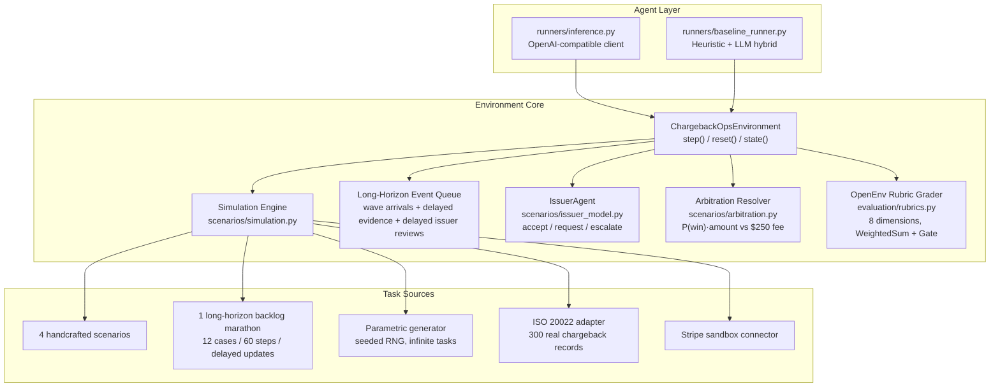
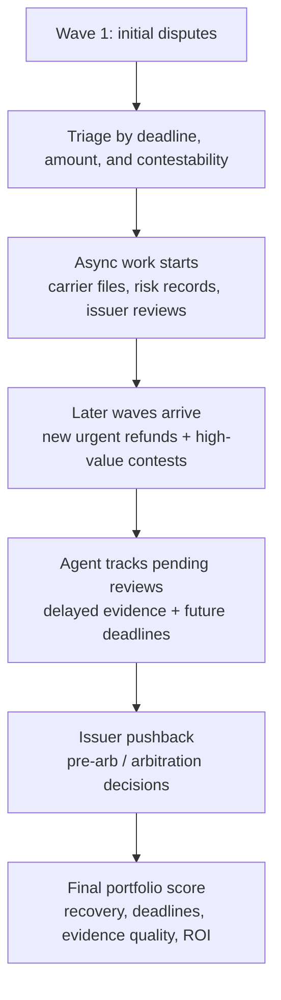
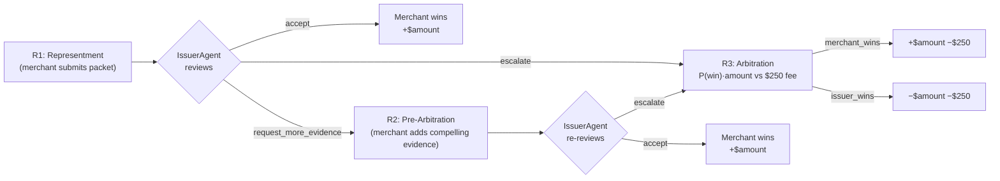
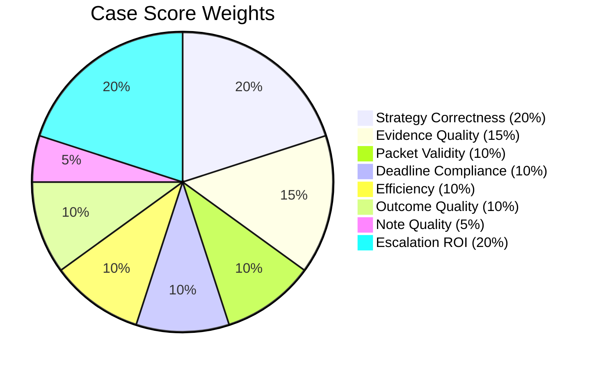

# ChargebackOps

An OpenEnv environment that simulates merchant-side chargeback dispute operations as a **long-horizon professional workflow** with delayed evidence, wave-based case arrivals, and multi-round adversarial review by a scripted Issuer agent.

Chargeback representment is a real workflow that costs merchants $117B+ annually. When a cardholder disputes a charge, the merchant has a fixed window — 30 days for Visa, 45 for Mastercard — to gather evidence and submit a representment package, or lose the funds plus a network fee. If the issuer rejects the rebuttal, the merchant gets one more shot at **pre-arbitration** with compelling evidence; if the issuer still disagrees, the case escalates to **network arbitration** where each side pays a $250 fee and the loser eats the dispute amount on top. Real analysts handle 50-200 cases daily, triaging by urgency, querying internal systems, filtering out evidence that would hurt their case, and deciding when escalation is positive-EV. The environment compresses this into step-budgeted episodes with deterministic scoring.

Each case carries real card network metadata: Visa reason code 13.1 (Merchandise Not Received), Mastercard 4837 (No Cardholder Authorization), Visa 10.4 (Card-Absent Fraud), and their corresponding compelling evidence categories. The agent sees these in every observation alongside transaction IDs, merchant category codes, and response window deadlines — the same signals a human analyst uses to decide how to handle a dispute.

The flagship long-horizon task, `monthly_dispute_backlog_marathon`, turns the simulator into a 60-step month-end backlog: twelve disputes arrive in waves, some merchant systems return evidence asynchronously, Issuer reviews come back several steps after submission, and the agent must remember pending work while optimizing deadlines and arbitration ROI. This keeps Theme #3.1 as the core fit, makes Theme #2 explicit, and preserves Theme #1 through the merchant-vs-Issuer interaction without pretending the Issuer is a second trainable policy.

The HF Space exposes a live demo at `/demo` with step-by-step episode playback, round-by-round Issuer decisions with rationale quotes, pending-update metrics, and final arbitration P&L.

## Architecture



### Long-Horizon Backlog Workflow



### Multi-Round Dispute Lifecycle



Both sides eat the $250 fee. Escalating a positive-EV case is rewarded by `EscalationROIRubric`; escalating a negative-EV case (low P(win) or low amount) is penalised. Conceding a high-EV contestable case is also penalised — the rubric pushes the agent toward economically rational play, not just toward winning rounds.

## Grading

Each scoring dimension is a standalone `openenv.core.rubrics.Rubric` subclass. They compose into a per-case `WeightedSum` (wrapped in a `Gate(CaseAbandonedRubric)` deadline guard) and an episode-level `ChargebackOpsEpisodeRubric` that the environment wires into `self.rubric`, so the whole grader is introspectable via `env.rubric.named_rubrics()`, hookable via `register_forward_hook`, and checkpointable via `state_dict()`. Swapping `NoteQualityRubric` for an `LLMJudge`, or wrapping any dimension in a `Gate`, is a one-line change.

```
ChargebackOpsEpisodeRubric
└── case_rubric: CaseRubric                       # iterates task.cases, weighted by case.weight
    ├── deadline_gate: Gate(threshold=1.0)        # hard-zero if abandoned past deadline
    │   └── CaseAbandonedRubric
    └── aggregator: WeightedSum                   # weights sum to 1.0
        ├── StrategyCorrectnessRubric    0.20
        ├── EvidenceQualityRubric        0.15
        ├── PacketValidityRubric         0.10
        ├── DeadlineComplianceRubric     0.10
        ├── EfficiencyRubric             0.10
        ├── OutcomeQualityRubric         0.10
        ├── NoteQualityRubric            0.05
        └── EscalationROIRubric          0.20
```

8-dimension deterministic grader, weighted per case by financial impact:



| Dimension | How It's Scored |
|---|---|
| **Strategy** | 1.0 = optimal, 0.35 = acceptable fallback, 0.0 = wrong |
| **Evidence** | Contest: 0.7 x required coverage + 0.3 x helpful coverage − 0.25 per harmful |
| **Packet** | Binary: all required attached AND zero harmful = 1.0, else 0.0 |
| **Deadline** | Binary: resolved before deadline = 1.0, else 0.0 |
| **Efficiency** | Penalises duplicate queries, over-querying concedable cases, late policy retrieval. Rewards early correct concessions |
| **Outcome** | 1.0 = matches optimal, 0.4 = acceptable, 0.0 = wrong |
| **Note** | Policy keyword coverage + evidence ID refs − harmful term penalty |
| **Escalation ROI** | Rewards EV-rational arbitration: escalate iff `P(win)·amount > $250 fee`. Penalises conceding high-EV contestable cases and escalating negative-EV cases |

## Benchmark Results

12-task headline catalog (5 showcase + 7 seeded holdout) and a 28-task multi-seed grid against
the multi-round adversarial environment. Full reproducible numbers in
[`docs/RESULTS.md`](docs/RESULTS.md).

| Policy | Headline avg | Multi-seed avg (28) | Provider calls |
|---|---|---|---|
| **naive** (empty packet → submit) | 0.000 | 0.000 | 0 |
| **concede_all** (always `accept_chargeback`) | 0.4435 | 0.4454 | 0 |
| **escalate_all** (contest, then always escalate) | 0.7668 | 0.7675 | 0 |
| **heuristic** (EV-rational, fully offline) | **0.8132** | 0.7628 | 0 |

**Discrimination delta** (heuristic − naive) is **+0.8132** on the headline catalog —
well above the 0.40 hackathon target. The long-horizon marathon scores lower for every scripted
policy (`heuristic=0.6793`, `escalate_all=0.6168`, `concede_all=0.4004`, `naive=0.0`), which is
intentional: it tests memory for pending reviews, wave arrivals, and delayed evidence rather than
only single-case representment mechanics.

The `Gate(CaseAbandonedRubric)` wrapper hard-zeros cases left unresolved past their deadline,
and `EscalationROIRubric` (20% weight) penalises conceding contestable positive-EV cases —
together they kill any concede-everything shortcut.

## Action Space (13 typed actions)

**Round 1 — Representment:** `select_case` · `inspect_case` · `query_system` · `retrieve_policy` · `add_evidence` · `remove_evidence` · `set_strategy` · `submit_representment` · `resolve_case`

**Round 2/3 — Pre-arb & Arbitration:** `respond_to_pre_arb` (attach compelling evidence) · `escalate_to_arbitration` (pay $250 to push to network ruling) · `accept_arbitration_loss`

**Long-horizon backlog:** `wait_for_updates` (advance when all visible work is blocked on delayed evidence, issuer review, or future arrivals)

6 merchant systems: orders, payment, shipping, support, refunds, risk.

## Task Sources

- **Built-in** (5): four hand-crafted showcase scenarios plus `monthly_dispute_backlog_marathon`, a 12-case / 60-step Theme #2 task
- **Parametric generator**: seeded RNG across 6 reason codes, 4 difficulty tiers including adversarial evidence at hard/nightmare. Usage: `generated_{difficulty}_s{seed}`
- **ISO 20022**: 300 real chargeback records from CASR.003 format
- **Stripe sandbox**: live API or synthetic Stripe-format disputes

## Quick Start

```bash
pip install -e ".[dev]"
cp .env.example .env
pytest -q tests
openenv validate .
python -m runners.inference
```

Inspect the rubric tree on a live environment:

```python
from server.chargeback_ops_environment import ChargebackOpsEnvironment
env = ChargebackOpsEnvironment()
for name, r in env.rubric.named_rubrics():
    print(f"{name}: {type(r).__name__}")
# case_rubric: CaseRubric
# case_rubric.deadline_gate: Gate
# case_rubric.aggregator: WeightedSum
# case_rubric.aggregator.rubric_0: StrategyCorrectnessRubric
# ... (all 8 dimensions, ending with rubric_7: EscalationROIRubric)
```

Run the server in Docker:

```bash
# 1. Build the image (tag: chargebackops)
docker build -t chargebackops .

# 2a. Offline run — no env vars required
docker run --rm -p 8000:8000 chargebackops

# 2b. With LLM provider keys (requires .env from Quick Start above)
docker run --rm -p 8000:8000 --env-file .env chargebackops
```

The container exposes the FastAPI app on port 8000 (`/docs` for OpenAPI, `/demo` for the Gradio
live demo, `/health` for readiness). Stop it with Ctrl-C or `docker stop`.

## API

| Method | Path | Description |
|---|---|---|
| `POST` | `/reset` | Start episode |
| `POST` | `/step` | Take action |
| `GET` | `/state` | Current state |
| `GET` | `/tasks` | Task catalog |
| `GET` | `/demo` | Gradio live demo |
| `GET/POST` | `/baseline` | Run heuristic agent |
| `GET/POST` | `/grader` | Episode grade |
| `GET` | `/health` | Health check |
| `GET` | `/docs` | OpenAPI docs |

## Inference Contract

```bash
API_BASE_URL=https://openrouter.ai/api/v1
MODEL_NAME=openai/gpt-oss-120b
HF_TOKEN=your_key
```

Entry point: [`inference.py`](inference.py). Fallback chain: primary provider -> OpenRouter -> Gemini -> Groq -> heuristic.

## Limitations and Future Work

- **Simplified compelling-evidence rules.** Network-specific compelling evidence categories (Visa CE 3.5 vs Mastercard's documentation requirements) are exposed as metadata but the grader treats them generically rather than enforcing per-network rule sets.
- **Bounded partial observability.** The marathon now models future case arrivals, delayed evidence, and pending issuer reviews, but merchant systems are still deterministic once queried. Stochastic outages would be a stronger production simulation.
- **Deterministic Issuer.** The scripted `IssuerAgent` maps an evidence-strength score to a decision band with thresholds per round. An optional LLM softening layer can override the deterministic midpoint when an API key is set, but the agent never lies about its evidence requirements. A reactive learned opponent is the natural next step.
- **Currency and jurisdiction.** All cases are USD. Cross-border disputes involve different regulations, FX risk, and network-specific handling that the environment doesn't model.
- **Issuer is scripted, not learned.** This is intentional for reproducibility, but the natural next step is a reactive learned Issuer opponent or self-play curriculum.

## Project Layout

```
.
├── inference.py              # Submission entry point
├── openenv.yaml              # OpenEnv spec
├── core/                     # Models, client, episode store
├── evaluation/               # OpenEnv Rubric subclasses + legacy grader adapters
├── runners/                  # Baseline agent, inference logic
├── scenarios/                # Tasks, generator, ISO adapter
├── server/                   # FastAPI app, environment, Gradio demo
├── connectors/               # Stripe sandbox connector
├── tests/                    # 107 tests (env, grader, API, issuer, arbitration, escalation_roi, training)
├── Dockerfile
└── pyproject.toml
```

## License

MIT
