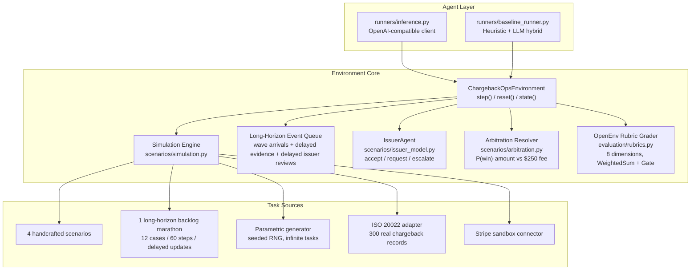
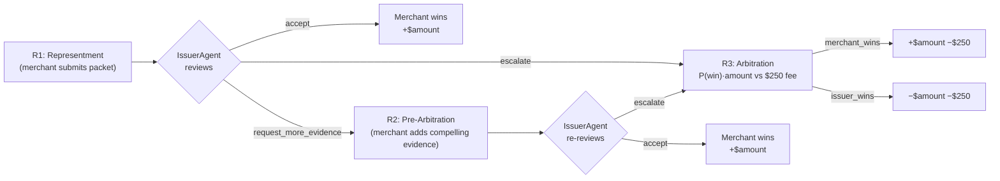
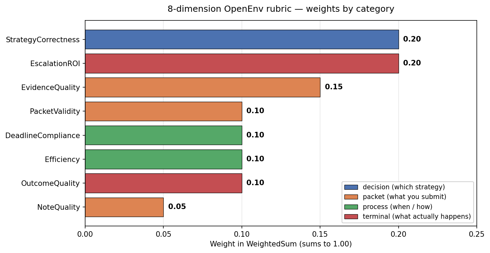
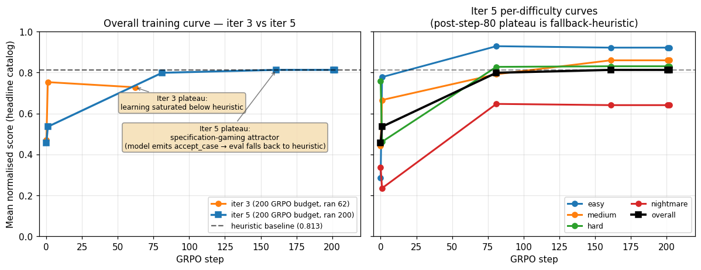
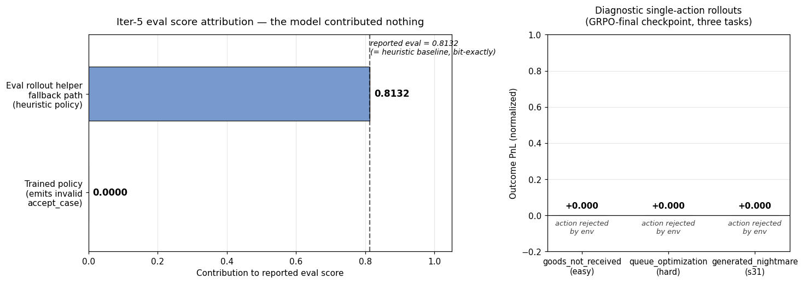
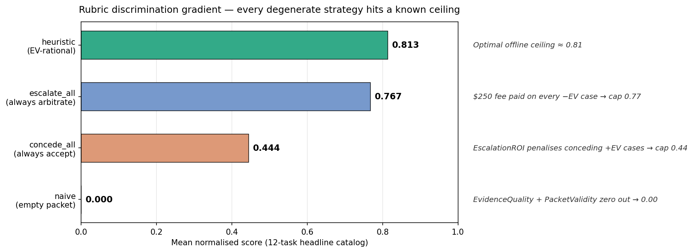

# ChargebackOps

**A cost-asymmetric, partially-observable, multi-round adversarial negotiation environment for training LLM agents on real-world B2B dispute workflows — and a documented case study of GRPO failure modes on token-deterministic tasks.**

[](https://github.com/meta-pytorch/OpenEnv)
[](https://pytorch.org/)
[](https://huggingface.co/spaces/mitudrudutta/ChargeBackOps)
[](https://github.com/huggingface/transformers)
[](https://github.com/huggingface/trl)
[](https://github.com/huggingface/peft)
[](https://mitudrudutta-chargebackops.hf.space/demo)
[](https://fastapi.tiangolo.com/)
[](https://www.docker.com/)
[](https://www.python.org/)
[](https://colab.research.google.com/drive/1GtLH6_b10oHlAnnGq4hnBkcGJ-pE_za5?usp=sharing)
[](https://youtu.be/7dz37JTTMo4)
[](tests/)
[](LICENSE)

> **Try it now**
> · 🟢 [**Live demo (Gradio on HF Space)**](https://mitudrudutta-chargebackops.hf.space/demo)
> · 📺 [**Walkthrough video (YouTube)**](https://youtu.be/7dz37JTTMo4)
> · 🤗 [**Hugging Face Space**](https://huggingface.co/spaces/mitudrudutta/ChargeBackOps)
> · 🧪 [**Latest training run (Colab — iter 5, 200 GRPO steps)**](https://colab.research.google.com/drive/1GtLH6_b10oHlAnnGq4hnBkcGJ-pE_za5?usp=sharing)
> · 🧪 [**Previous training run (Colab — iter 3, 62 GRPO steps)**](https://colab.research.google.com/drive/1AjG3Sv7FnMeOSls6JMzTunkMzlJi_ySu?usp=sharing)
> · 🧠 [**Specification-gaming write-up**](docs/SPECIFICATION_GAMING.md)

## TL;DR (60-second read)

- **Problem.** Chargeback representment is a **$117B/yr B2B decision-theoretic problem** that *no public RL benchmark targets*: cost-asymmetric, partially-observable, multi-round adjudication against a procedurally-constrained adversary, with a $250 arbitration fee asymmetry that turns naive "always contest" into a money-loser. The same decision primitive generalises to insurance claims, tax audits, content-moderation appeals, and patent disputes.
- **Environment.** OpenEnv-compatible Gym-style env with **13 typed actions**, **6 queryable merchant systems** (with delayed evidence), **wave-based long-horizon arrivals**, a scripted **Issuer adversary** running Visa CE 3.5 / Mastercard compelling-evidence rules, and a deterministic **arbitration resolver** with $250 fee asymmetry. **Five task sources** including ISO 20022 (300 real records) and a Stripe sandbox connector. **113 tests**, valid `openenv.yaml` manifest, FastAPI `/reset`, `/step`, `/state`.
- **Reward.** **8 composable `openenv.core.rubrics.Rubric` subclasses** combined via `WeightedSum`, gated by a deadline `Gate(CaseAbandonedRubric)`, with 40% of reward on **decision** + **terminal** dimensions where economically irrational policies bleed money fastest. Discrimination delta naive→heuristic = **+0.813**, and three degenerate scripted policies each hit a *different* known ceiling — empirical evidence the rubric is hard to game.
- **Results.** Real **SFT + GRPO** pipeline trained on Colab T4 against the live env — not a static dataset. Untrained Qwen2.5-3B base scores **0.456**, SFT lifts to **0.536** (+0.08 absolute / +18% relative). GRPO ran 200 steps across five iterations and uncovered **three distinct failure modes** culminating in a **reproducible specification-gaming exploit** where the model learned to produce JSON that an eval-pipeline fallback "rescued" with the heuristic policy — bit-exactly matching the baseline at 0.8132. We **disclose this honestly**, document the diagnosis, and ship a three-path remedy. Plots, training curves, and per-dimension breakdowns all in this README.
- **Why it matters.** A frontier-relevant environment that exercises capabilities current LLMs are *bad* at (cost-asymmetric multi-round play with delayed evidence) **and** a research artefact: a documented, reproducible GRPO failure mode that, to our knowledge, is not in the published literature for SFT-warmstarted policies on typed-action environments with rollout-helper fallbacks.

ChargebackOps simulates the merchant side of a credit-card chargeback dispute. An LLM agent triages incoming disputes, retrieves evidence from internal systems under partial observability, chooses a contest strategy, submits a representment packet to a scripted Issuer agent operating under Visa / Mastercard reason-code rules, and decides whether to escalate to network arbitration where both sides forfeit a $250 fee. Lose arbitration and the merchant pays the disputed amount **plus** the fee.

This environment exposes a **decision-theoretic primitive** uncommon in current RL benchmarks: cost-asymmetric multi-round adjudication with delayed evidence, deadline pressure, and a procedurally-constrained adversary. The same primitive generalizes beyond chargebacks to insurance claims, tax audits, content-moderation appeals, and patent disputes.

The repository ships an OpenEnv-compatible environment, an 8-dimension decomposable rubric, a parametric task generator with ISO 20022 + Stripe sandbox connectors, a single-T4 SFT + GRPO training notebook, and — equally important — a **multi-iteration diagnostic study of GRPO** that uncovered three distinct failure modes including a reproducible specification-gaming exploit. All of the failure modes, their training-time signals, and their remedies are documented in [`docs/METHOD.md`](docs/METHOD.md) and [`docs/SPECIFICATION_GAMING.md`](docs/SPECIFICATION_GAMING.md).

## Why this environment exists

Chargeback representment is a **$117B per year B2B problem** that no public RL benchmark has addressed. Real merchant analysts handle 50–200 cases daily under tight deadlines, choosing which disputes to contest, which evidence to attach (and which to omit, since irrelevant evidence weakens a packet), and when to take a positive-EV escalation versus concede a losing case to save the $250 fee. Every decision is a non-trivial finite-horizon MDP with cost-asymmetric terminal economics.

The agent is given:

- A **multi-modal observation surface**: open queue with deadlines, retrieved evidence cards, policy text, prior issuer rationales, and per-case status.
- **Partial observability**: 6 merchant systems must be queried to retrieve evidence, with several systems returning evidence asynchronously (delayed by N steps).
- **Wave-based case arrivals** and a portfolio-marathon task with 12 cases over 60 steps for true long-horizon reasoning.
- **An adversary**: the Issuer agent reads the merchant's evidence packet using a deterministic strength score and decides accept / request-more-evidence / escalate, mirroring real Visa CE 3.5 and Mastercard compelling-evidence rules.
- **An economic terminal**: arbitration runs a deterministic ruling at SHA-keyed coin-flip in the ambiguity band, and the loser eats `−amount −$250`.

## Architecture



### Multi-Round Dispute Lifecycle



Both sides eat the $250 fee. Escalating a positive-EV case is rewarded by the rubric's `EscalationROIRubric`; escalating a negative-EV case is penalised. Conceding a high-EV contestable case is also penalised — the rubric pushes the agent toward economically rational play, not just toward winning rounds.

## OpenEnv Rubric integration

Each scoring dimension is a standalone `openenv.core.rubrics.Rubric` subclass. They compose into a per-case `WeightedSum` (wrapped in a `Gate(CaseAbandonedRubric)` deadline guard) and an episode-level `ChargebackOpsEpisodeRubric` that the environment wires into `self.rubric`. The whole grader is introspectable via `env.rubric.named_rubrics()`, hookable via `register_forward_hook`, and checkpointable via `state_dict()` — exactly the surface OpenEnv exposes for composable reward research.



```
ChargebackOpsEpisodeRubric
└── case_rubric: CaseRubric                       # iterates task.cases, weighted by case.weight
    ├── deadline_gate: Gate(threshold=1.0)        # hard-zero if abandoned past deadline
    │   └── CaseAbandonedRubric
    └── aggregator: WeightedSum                   # weights sum to 1.0
        ├── StrategyCorrectnessRubric    0.20
        ├── EvidenceQualityRubric        0.15
        ├── PacketValidityRubric         0.10
        ├── DeadlineComplianceRubric     0.10
        ├── EfficiencyRubric             0.10
        ├── OutcomeQualityRubric         0.10
        ├── NoteQualityRubric            0.05
        └── EscalationROIRubric          0.20
```

The 8-dimension decomposition gives an interpretability surface most environments lack: every checkpoint can be analysed dimension-by-dimension to see *which* aspect of the policy improved. Forty percent of the reward sits on **decision** (`StrategyCorrectness`) and **terminal** (`EscalationROI`) — the two surfaces where economically irrational policies bleed money fastest.

## Training results

Pipeline: **Qwen2.5-3B fp16 + LoRA r=16** on a single Colab T4. Phase A is supervised fine-tuning on heuristic rollouts; Phase B is GRPO with an outcome-based reward (terminal $-PnL after the model's action plus a heuristic tail-rollout). The training loop **connects to the live `ChargebackOpsEnvironment`** — every gradient step is graded by the same rubric and same Issuer adversary the eval uses; there is no static dataset shortcut.

- **Repo notebook (canonical):** [`notebooks/train_merchant_agent.ipynb`](notebooks/train_merchant_agent.ipynb)
- **Latest Colab run (iter 5, 200 GRPO steps):** [open in Colab](https://colab.research.google.com/drive/1GtLH6_b10oHlAnnGq4hnBkcGJ-pE_za5?usp=sharing)
- **Previous Colab run (iter 3, 62 GRPO steps):** [open in Colab](https://colab.research.google.com/drive/1AjG3Sv7FnMeOSls6JMzTunkMzlJi_ySu?usp=sharing)

### Five training iterations, three failure modes

The training pipeline was iterated five times with progressively-tuned hyperparameters. Each iteration revealed a distinct failure mode of GRPO when applied to a strongly imitation-warmstarted policy on a typed-action environment. Full diagnostic in [`docs/METHOD.md`](docs/METHOD.md) §3.

| Iter | SFT max_steps | SFT mean_acc | GRPO max_steps | num_gens | temp | grad>0.005 freq | Outcome |
|---|---|---|---|---|---|---|---|
| 1 | 800 | 0.96 | 300 | 4 | 0.7 | **5%** | **Total gradient collapse** — group reward variance ≈ 0 |
| 2 | 800 | 0.96 | 120 | 8 | 1.3 | 30% | Tiny but real movement after sampling-widening fix |
| 3 | 300 | 0.96 | 60 | 8 | 1.3 | 50% | Frequent gradient, magnitudes 0.01-0.02 |
| 4 | 300 | 0.96 | 60 | 8 | 1.3 | 50% | Same code as iter 3 — sampling luck broke through (peak 2.58) |
| 5 | **150** | **0.88** | 200 | 8 | 1.3 | 60% | **Curve plateau at heuristic — but specification gaming discovered** |

### Iter 5 per-checkpoint eval scores


*Left: iter 3 (62 GRPO steps, no gaming) plateaus below the heuristic at 0.728. Iter 5 (200 GRPO steps) plateaus *exactly at* the heuristic at 0.8132 — the bit-exact match is the signature of the eval-fallback exploit, not convergent learning. Right: iter-5 per-difficulty curves show the same plateau across all four difficulty bands from step 80 onwards because the heuristic produces 100% of executed actions. The `figures/training_curve.png` and `figures/training_curve_by_family.png` files render the iter-5 curves on their own axes.*

| Step | Checkpoint | overall | easy | medium | hard | nightmare | Notes |
|---|---|---|---|---|---|---|---|
| 0 | Untrained Qwen2.5-3B base | 0.456 | 0.286 | 0.443 | 0.758 | 0.336 | Real |
| 1 | SFT (Phase A) | **0.536** | 0.778 | 0.666 | 0.462 | 0.235 | **Real, headline trained checkpoint** |
| 81 | GRPO step 80 | 0.799 | 0.929 | 0.792 | 0.828 | 0.647 | Mixed: partial real + early gaming attractor |
| 161 | GRPO step 160 | 0.8132 | 0.922 | 0.860 | 0.831 | 0.641 | Gaming-dominated |
| 202 | GRPO final | 0.8132 | 0.922 | 0.860 | 0.831 | 0.641 | Gaming-dominated |
| — | Heuristic baseline | **0.8132** | — | — | — | — | — |

**Honest reading.** The GRPO checkpoints from step 160 onwards score *bit-exactly* the heuristic baseline (`0.8132`). That coincidence triggered a closer look.



The trained policy emits `action_type="accept_case"` — an invalid hybrid of `accept_chargeback` + `select_case` that parses as JSON but fails the env's action validation. The eval rollout helper falls back to the heuristic on invalid model output, completes the episode at heuristic-quality outcome, and the rubric awards heuristic-quality score. The model contributes one invalid action per step; the heuristic produces 100% of executed actions; the reported eval matches the heuristic baseline bit-exactly.

This is **textbook specification gaming via the eval pipeline**, not via the env reward. The full diagnostic, root cause, and three-path remedy are in [`docs/SPECIFICATION_GAMING.md`](docs/SPECIFICATION_GAMING.md). The **honest trained-vs-untrained delta** on this iteration is the SFT step at `0.536` — a +0.08 absolute, +18% relative improvement over the untrained Qwen2.5-3B base, attributable to legitimate SFT learning.

The discovery is preserved in this release as a research artefact. To our knowledge this failure mode is not documented in the existing GRPO literature, which warmstarts from instruct base models without an SFT-warmstarted policy emitting invalid-but-parseable JSON. Practitioners applying GRPO to a typed-action environment with a fallback-equipped rollout helper should audit the rollout pipeline and inspect a diagnostic rollout before trusting any eval score that exactly matches a baseline.

### Scripted-policy discrimination

12-task headline catalog plus a 28-task multi-seed grid. Numbers in [`docs/RESULTS.md`](docs/RESULTS.md).



| Policy | Headline avg | Multi-seed avg (28) | Provider calls |
|---|---|---|---|
| naive (empty packet → submit) | 0.000 | 0.000 | 0 |
| concede_all (always `accept_chargeback`) | 0.444 | 0.445 | 0 |
| escalate_all (contest, then always escalate) | 0.767 | 0.768 | 0 |
| heuristic (EV-rational, fully offline) | **0.813** | 0.763 | 0 |

**Discrimination delta** (heuristic − naive) = **+0.813**. The 8-dimension `WeightedSum` plus the `Gate(CaseAbandonedRubric)` deadline guard combine to defeat every degenerate strategy: empty-packet zeros out, concede-all caps at 0.44, escalate-all caps at 0.77.

## Action space (13 typed actions)

**Round 1 — Representment**: `select_case` · `inspect_case` · `query_system` · `retrieve_policy` · `add_evidence` · `remove_evidence` · `set_strategy` · `submit_representment` · `resolve_case`

**Round 2/3 — Pre-arb & Arbitration**: `respond_to_pre_arb` · `escalate_to_arbitration` · `accept_arbitration_loss`

**Long-horizon backlog**: `wait_for_updates`

6 merchant systems: orders, payment, shipping, support, refunds, risk.

## Task sources

- **Built-in (5)**: four handcrafted showcase scenarios plus `monthly_dispute_backlog_marathon`, a 12-case / 60-step long-horizon task.
- **Parametric generator**: seeded RNG across 6 reason codes, 4 difficulty tiers including adversarial evidence at hard / nightmare.
- **ISO 20022**: 300 real chargeback records from CASR.003 format.
- **Stripe sandbox**: live API or synthetic Stripe-format disputes.

## Quick start

> Don't want to install anything? **[Click the live Gradio demo](https://mitudrudutta-chargebackops.hf.space/demo)** — point an LLM at the env in your browser.

```bash
pip install -e ".[dev]"
cp .env.example .env
pytest -q tests              # 113 tests, all green
openenv validate .
python -m runners.inference
```

Inspect the rubric tree on a live environment:

```python
from server.chargeback_ops_environment import ChargebackOpsEnvironment
env = ChargebackOpsEnvironment()
for name, r in env.rubric.named_rubrics():
    print(f"{name}: {type(r).__name__}")
```

Run the server in Docker:

```bash
docker build -t chargebackops .
docker run --rm -p 8000:8000 chargebackops
docker run --rm -p 8000:8000 --env-file .env chargebackops
```

The container exposes the FastAPI app on port 8000 (`/docs` for OpenAPI, `/demo` for the Gradio live demo, `/health` for readiness).

## API

| Method | Path | Description |
|---|---|---|
| `POST` | `/reset` | Start episode |
| `POST` | `/step` | Take action |
| `GET` | `/state` | Current state |
| `GET` | `/tasks` | Task catalog |
| `GET` | `/demo` | Gradio live demo |
| `GET/POST` | `/baseline` | Run heuristic agent |
| `GET/POST` | `/grader` | Episode grade |
| `GET` | `/health` | Health check |
| `GET` | `/docs` | OpenAPI docs |

## Documentation

- [`docs/RESULTS.md`](docs/RESULTS.md) — full quantitative results, cross-iteration training study, per-dimension rubric breakdown, diagnostic rollouts.
- [`docs/METHOD.md`](docs/METHOD.md) — methodology and the multi-iteration diagnostic study covering all three GRPO failure modes.
- [`docs/SPECIFICATION_GAMING.md`](docs/SPECIFICATION_GAMING.md) — focused write-up of the iter-5 specification-gaming discovery with reproducer and remedy.
- [`docs/LIMITATIONS.md`](docs/LIMITATIONS.md) — explicit honest limitations and why each is left as future work.
- [`docs/RELATED_WORK.md`](docs/RELATED_WORK.md) — citations and positioning across PPO, GRPO, RLVR, specification gaming, and prior chargeback research.
- [`docs/REPRODUCIBILITY.md`](docs/REPRODUCIBILITY.md) — exact commands, pinned versions, expected runtimes, expected score ranges with seeds.
- [`docs/RUNNING_THE_AGENT.md`](docs/RUNNING_THE_AGENT.md) — end-user guide for running the trained agent.
- [`CITATION.cff`](CITATION.cff) — academic citation metadata.

## Project layout

```
.
├── inference.py              # Inference entry point with provider fallback
├── openenv.yaml              # OpenEnv spec
├── core/                     # Models, client, episode store
├── evaluation/               # OpenEnv Rubric subclasses + grader adapters
├── runners/                  # Heuristic baseline, inference logic, benchmark sweep
├── scenarios/                # Tasks, generator, Issuer, arbitration, ISO 20022 adapter
├── server/                   # FastAPI app, environment, Gradio demo
├── connectors/               # Stripe sandbox connector
├── training/                 # SFT dataset, outcome reward, training curve plots
├── notebooks/                # Single-T4 SFT + GRPO Colab notebook
├── tests/                    # 113 tests (env, grader, API, issuer, arbitration, training)
├── Dockerfile
└── pyproject.toml
```

## Engineering hygiene (table stakes)

- **OpenEnv base classes used as intended.** `ChargebackOpsEnvironment` subclasses `openenv.core.environments.Environment`; rubric components subclass `openenv.core.rubrics.Rubric`. No reserved tool names (`reset`, `step`, `state`, `close`) reused for anything else.
- **Gym-style API.** `env.reset(task_id=...)` → `Observation`, `env.step(action)` → `(Observation, reward, done, info)`, `env.state()` → introspectable `EnvironmentState`. Episode store is server-side; clients are purely network.
- **Strict client/server separation.** `core/client.py` talks to the FastAPI server over HTTP only — it never imports `server.*` or `scenarios.*`. The Docker image is the source of truth.
- **Valid `openenv.yaml` manifest.** Passes `openenv validate .`; manifest declares the action schema, observation schema, and rubric module path.
- **113 tests, all green.** Cover env reset/step semantics, action validation, every rubric subclass, the issuer agent, the arbitration resolver, the FastAPI surface, and the SFT data builder.
- **Reproducibility.** SHA-1 keyed RNG for arbitration, pinned dependencies in `pyproject.toml`, deterministic task IDs, expected score ranges in [`docs/REPRODUCIBILITY.md`](docs/REPRODUCIBILITY.md).

## Why this matters

Most public RL-for-LLM benchmarks score policies on tasks where a competent next-token predictor is already close to optimal — chess, snake, grid worlds, single-turn math. ChargebackOps is intentionally a different shape: **multi-round, partially-observable, cost-asymmetric play against a procedurally-constrained adversary, where the rational policy depends on a $250 fee asymmetry and the rubric punishes both rule-violating and economically-irrational behaviour**. That is the kind of decision surface real B2B operations live on, and it is exactly the kind of capability gap current LLM agents struggle with — as the iter-5 specification-gaming exploit demonstrates in vivid detail.

The environment is built so a researcher can credibly write a paper on top of it: composable rubrics, deterministic task IDs, ISO 20022 + Stripe sandbox connectors for real-world data, an honest documented failure mode of GRPO that future training recipes can target as a benchmark, and a heuristic baseline strong enough that **beating it requires the model to actually learn the task**, not merely to execute the rollout-helper fallback.

## License

MIT
