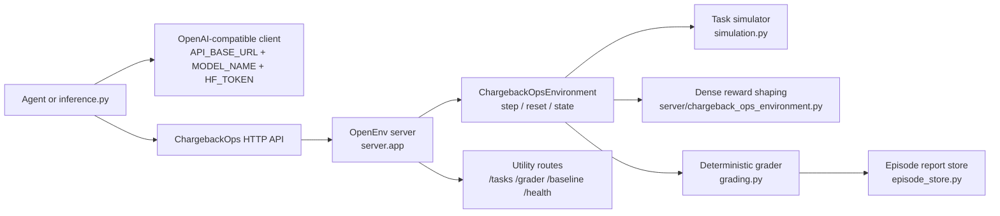
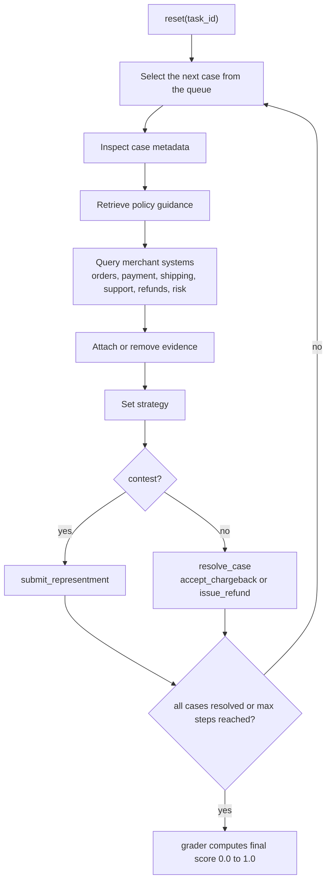

# ChargebackOps

ChargebackOps is a real-world OpenEnv environment for merchant-side chargeback operations. An agent acts as a dispute analyst, works a queue of payment disputes, investigates evidence across synthetic internal systems, chooses whether to contest or concede, and is graded on recovery quality, deadline handling, and operational discipline.

The environment is designed for the Round 1 OpenEnv problem statement:

- Real-world task, not a game or toy
- Typed OpenEnv models and `reset()` / `step()` / `state()` support
- Three graded tasks with easy, medium, and hard difficulty
- Dense reward shaping with partial progress and negative signals
- Root-level `inference.py` that uses the OpenAI client contract
- Docker and Hugging Face Spaces deployment path

## Why This Environment Matters

Merchant dispute handling is a real operations workflow. Analysts do not just classify a ticket or answer a question. They must:

- inspect the dispute reason code and the response deadline
- gather evidence from the right internal systems
- avoid attaching evidence that weakens the case
- choose whether to contest, accept, or refund
- maximize recovery across a queue under limited time

That makes ChargebackOps a strong benchmark for tool-using agents. It tests retrieval, decision-making, prioritization, and operational restraint in a controlled environment with deterministic scoring.

## System Architecture



## Episode Workflow



## Environment Design

### Internal systems

The environment exposes evidence gradually from six synthetic merchant systems:

- `orders`
- `payment`
- `shipping`
- `support`
- `refunds`
- `risk`

Each task contains hidden ground truth about:

- optimal strategy per case
- acceptable fallback strategies
- required evidence
- helpful evidence
- harmful evidence
- deadline pressure
- case weight in the final score

### OpenEnv contract

| Method | Behavior |
| --- | --- |
| `reset(task_id=...)` | starts a fresh episode and returns the initial typed observation |
| `step(action)` | applies one typed action and returns the next observation with reward and done |
| `state()` | returns the current typed internal state |

Core runtime files:

- [`models.py`](/home/btwitsvoid/Documents/Agents/ChargeBackOps/models.py)
- [`server/chargeback_ops_environment.py`](/home/btwitsvoid/Documents/Agents/ChargeBackOps/server/chargeback_ops_environment.py)
- [`server/app.py`](/home/btwitsvoid/Documents/Agents/ChargeBackOps/server/app.py)
- [`openenv.yaml`](/home/btwitsvoid/Documents/Agents/ChargeBackOps/openenv.yaml)

## Typed Spaces

### Action space

| Action | Purpose |
| --- | --- |
| `select_case` | focus a case from the queue |
| `inspect_case` | reveal analyst notes for the selected case |
| `query_system` | pull evidence from one merchant system |
| `retrieve_policy` | reveal reason-code guidance and required evidence |
| `add_evidence` | attach retrieved evidence to the current package |
| `remove_evidence` | remove evidence, including harmful attachments |
| `set_strategy` | choose `contest`, `accept_chargeback`, or `issue_refund` |
| `submit_representment` | submit a contest package for a contested case |
| `resolve_case` | close a non-contest case with acceptance or refund |

### Observation space

Each observation includes:

- task metadata: id, title, difficulty, objective
- current queue with deadlines and case summaries
- currently selected case
- visible evidence and policy data
- available actions
- `steps_remaining`
- `progress_score`
- `last_action_result`
- optional terminal `grader_report`

### State space

The environment state exposes:

- current episode id and step count
- public queue resolution state
- action history
- latest grade estimate
- final grader report once complete

## Task Suite

| Task ID | Title | Difficulty | Objective |
| --- | --- | --- | --- |
| `goods_not_received_easy` | Delivered But Disputed | easy | contest a straightforward goods-not-received case with delivery proof |
| `fraud_signal_ambiguity` | Fraud Signal Ambiguity | medium | handle a card-not-present fraud dispute with mixed evidence and harmful artifacts |
| `queue_optimization_hard` | Dispute Queue Optimization | hard | maximize recovery across a multi-case queue under tight step and deadline pressure |

Difficulty progression is deliberate:

- Easy teaches the standard representment loop.
- Medium introduces ambiguity and evidence curation.
- Hard adds queue prioritization, step-budget pressure, and opportunity cost.

## Reward Design

ChargebackOps provides dense per-step feedback and a terminal bonus. The environment rewards progress and penalizes obviously bad operations behavior.

Positive signals include:

- selecting and inspecting the right case
- retrieving policy guidance
- querying systems that expose useful evidence
- attaching helpful or required evidence
- setting the optimal strategy
- submitting a complete representment on time
- resolving a case with the optimal non-contest strategy

Negative signals include:

- invalid actions
- duplicate system queries
- attaching harmful evidence
- removing helpful evidence
- weak strategy choices
- submitting incomplete or late representments
- missing deadlines on still-open cases

At episode end, the environment adds a terminal bonus proportional to the deterministic grader score.

## Grading

Each finished episode is scored in `[0.0, 1.0]` by the deterministic grader in [`grading.py`](/home/btwitsvoid/Documents/Agents/ChargeBackOps/grading.py).

Per-case weighting:

| Component | Weight |
| --- | --- |
| strategy correctness | 0.25 |
| evidence quality | 0.25 |
| packet validity | 0.15 |
| deadline compliance | 0.15 |
| efficiency | 0.10 |
| outcome quality | 0.10 |

The hard task aggregates multiple case scores by case weight and normalizes the final result to `0.0` to `1.0`.

## Inference and Model Providers

The required root inference entry point is [`inference.py`](/home/btwitsvoid/Documents/Agents/ChargeBackOps/inference.py). It uses the OpenAI Python client with the challenge-compatible environment variables:

- `API_BASE_URL`
- `MODEL_NAME`
- `HF_TOKEN`

Default configuration:

- provider path: OpenRouter
- model: `openai/gpt-oss-120b`

Also supported through the same OpenAI-compatible client pattern:

- OpenAI
- Anthropic-compatible gateways
- Groq
- OpenRouter

The repository also keeps optional direct keys for convenience in [`.env.example`](/home/btwitsvoid/Documents/Agents/ChargeBackOps/.env.example):

- `OPENAI_API_KEY`
- `ANTHROPIC_API_KEY`
- `GROQ_API_KEY`
- `OPENROUTER_API_KEY`

### OpenRouter referer

Leave `OPENROUTER_HTTP_REFERER` empty during local development. Once the app is deployed, set it to the public app URL, for example:

```bash
OPENROUTER_HTTP_REFERER=https://your-space-name.hf.space
OPENROUTER_APP_TITLE=ChargebackOps
```

## Baseline Results

The repository includes two baseline entry points:

- [`inference.py`](/home/btwitsvoid/Documents/Agents/ChargeBackOps/inference.py) for the challenge contract
- [`baseline_runner.py`](/home/btwitsvoid/Documents/Agents/ChargeBackOps/baseline_runner.py) for direct local runs and the `/baseline` endpoint

Verified local heuristic-fallback baseline scores are documented below after the latest validation pass:

| Task | Score |
| --- | --- |
| Delivered But Disputed | `0.7075` |
| Fraud Signal Ambiguity | `0.7075` |
| Dispute Queue Optimization | `0.7271` |
| Average | `0.7140` |

These values are replaced after each validation run so the README reflects real, reproducible output from the current codebase.

## API Surface

The FastAPI app exposes:

- `GET /` basic service ping
- `GET /health` health check
- `GET /docs` interactive OpenAPI docs
- `POST /reset` start a new episode
- `POST /step` advance the environment
- `GET /state` inspect the current state
- `GET /tasks` enumerate tasks and the action schema
- `GET /grader` or `POST /grader` fetch the last completed episode grade
- `GET /baseline` or `POST /baseline` run the bundled baseline

## Local Setup

### 1. Install dependencies

Using `uv`:

```bash
uv sync --extra dev
```

Using `pip`:

```bash
python -m pip install -e ".[dev]"
```

### 2. Configure environment variables

```bash
cp .env.example .env
```

At minimum, configure:

```bash
API_BASE_URL=https://openrouter.ai/api/v1
MODEL_NAME=openai/gpt-oss-120b
HF_TOKEN=your_provider_key
```

### 3. Run the test and validation suite

```bash
pytest -q tests
openenv validate .
python inference.py
```

### 4. Start the server locally

```bash
uvicorn server.app:app --host 0.0.0.0 --port 8000
```

## Docker

Build and run the root Docker image:

```bash
docker build -t chargebackops .
docker run --rm -p 8000:8000 --env-file .env chargebackops
```

Once the container is running:

```bash
curl http://localhost:8000/
curl http://localhost:8000/tasks
curl http://localhost:8000/health
```

## Hugging Face Spaces Deployment

ChargebackOps is configured as a Docker Space through the YAML frontmatter in this README.

Recommended deployment steps:

1. Create a new Hugging Face Space with `Docker` as the SDK.
2. Push this repository to the Space.
3. Add the runtime variables in Space Settings:
   - `API_BASE_URL`
   - `MODEL_NAME`
   - `HF_TOKEN`
4. If using OpenRouter, add:
   - `OPENROUTER_HTTP_REFERER=https://your-space-name.hf.space`
   - `OPENROUTER_APP_TITLE=ChargebackOps`
5. Verify:
   - `/`
   - `/health`
   - `/tasks`
   - `/docs`
   - `/baseline`

## Validation Checklist

- `pytest -q tests`
- `openenv validate .`
- `python inference.py`
- `docker build -t chargebackops .`
- `docker run --rm -p 8000:8000 --env-file .env chargebackops`

## Project Layout

```text
.
├── baseline_runner.py
├── client.py
├── grading.py
├── inference.py
├── models.py
├── openenv.yaml
├── server/
│   ├── app.py
│   └── chargeback_ops_environment.py
├── simulation.py
└── tests/
```

## Notes

- This is a synthetic benchmark environment, not a live payments integration.
- The world state is deterministic by design so graders remain reproducible.
- Live model quality still depends on the quota and reliability of the configured provider.
