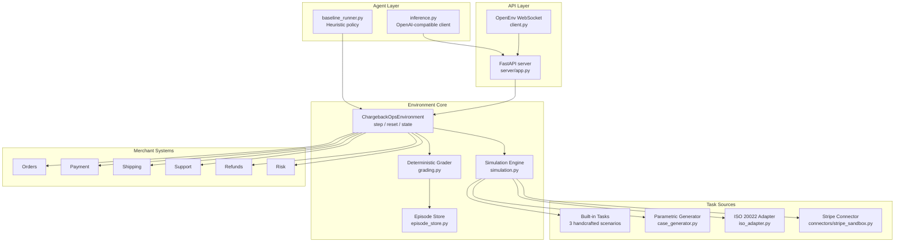
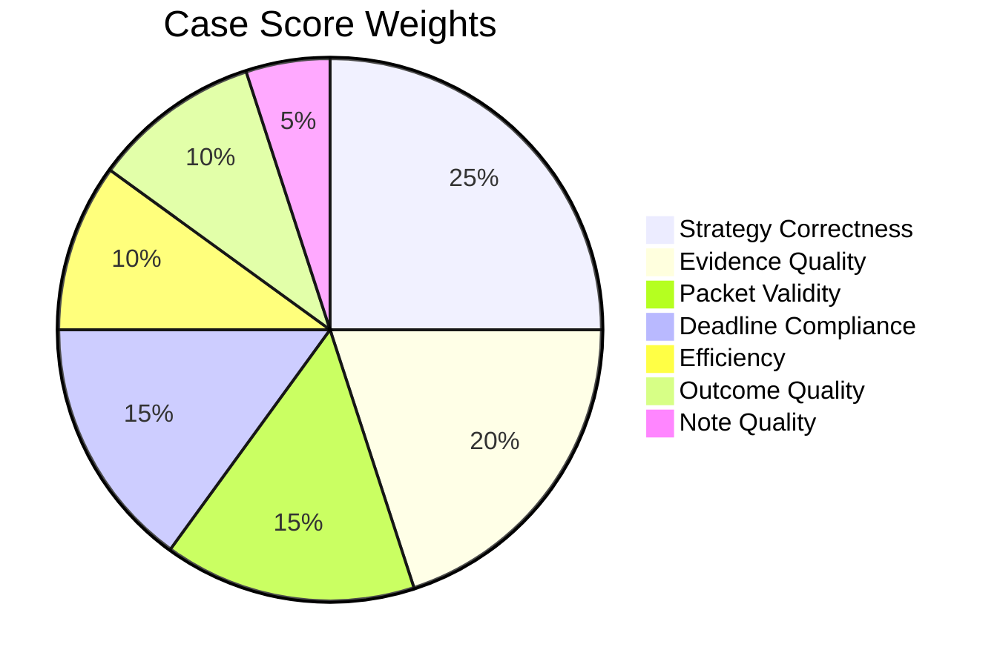

# ChargebackOps


ChargebackOps is an OpenEnv environment for merchant-side chargeback and dispute operations. The agent acts as a dispute analyst: it triages open disputes, retrieves evidence from merchant systems, decides whether to contest or concede, and resolves each case under deadline and step-budget pressure.

The repository is designed for agent evaluation rather than generic chat. It exposes a typed action space, deterministic state transitions, dense reward shaping, and programmatic grading so model behavior can be measured as operational performance.

## Why This Environment Matters

Chargeback dispute handling is a real operations workflow. Analysts must:

- interpret reason codes and response deadlines
- gather evidence from the correct internal systems while avoiding harmful artifacts
- decide whether to contest, accept, or refund
- prioritize multiple disputes by urgency, recoverability, and operational cost

That makes ChargebackOps a good benchmark for tool-using agents. It measures retrieval quality, decision quality, prioritization, and operational restraint in a controlled environment with deterministic scoring.

## Architecture



## Episode Workflow

```mermaid
flowchart TD
    A[reset&#40;task_id&#41;] --> B[Select case from queue]
    B --> C{Reason code<br/>deterministic?}
    C -->|Yes| D[Skip policy retrieval<br/>Infer strategy directly]
    C -->|No| E[Retrieve policy guidance]
    D --> F[Query merchant systems<br/>for evidence]
    E --> F
    F --> G[Attach relevant evidence<br/>Avoid harmful artifacts]
    G --> H[Set strategy]
    H --> I{Strategy?}
    I -->|contest| J[Generate representment note<br/>Submit package]
    I -->|accept / refund| K[Resolve case]
    J --> L{More open cases?}
    K --> L
    L -->|Yes| M{Deadline urgency?}
    M -->|Urgent| N[Switch to urgent case<br/>Fast-resolve]
    M -->|Normal| B
    N --> L
    L -->|No / Max steps| O[Grader computes<br/>final score 0.0 - 1.0]

    style A fill:#2d5016,color:#fff
    style O fill:#1a3a5c,color:#fff
    style N fill:#8b0000,color:#fff
```



## Grading Dimensions



Each case is scored across seven dimensions and weighted by financial impact. The episode score normalizes across all cases to `[0.0, 1.0]`.

## Agent Performance (126 Episodes)

Results from the heuristic agent tested across all data sources:

| Source | Easy | Medium | Hard |
|---|---|---|---|
| Built-in tasks | 0.968 | 0.960 | 0.778 |
| Parametric (20 seeds) | 0.957 | 0.844 | 0.706 |
| ISO 20022 real data (20 each) | 0.977 | 0.812 | 0.605 |
| Stripe live API | 0.980 | 0.887 | 0.577 |

**Overall: 0.819 avg across 126 episodes | 43.7% score >= 0.90 | 5.6% score < 0.50**

Heuristic vs bad-control gap: **+0.503** (threshold for "strong": 0.15)

## Task Sources

### Built-in Scenarios (3 tasks)

| Task ID | Difficulty | Objective |
|---|---|---|
| `goods_not_received_easy` | Easy | Contest a goods-not-received case with delivery proof |
| `fraud_signal_ambiguity` | Medium | Handle CNP fraud with mixed evidence and harmful artifacts |
| `queue_optimization_hard` | Hard | Maximize recovery across a multi-case queue under deadline pressure |

### Parametric Generator (`case_generator.py`)

Generates infinite reproducible tasks from seeded RNG across 6 reason code families. Usage: `generated_{difficulty}_s{seed}` (e.g., `generated_hard_s42`).

### ISO 20022 Real Data (`iso_adapter.py`)

Converts 300 real chargeback records from ISO 20022 CASR.003 format into environment cases. Covers fraud, goods-not-received, duplicate processing, credit-not-processed, product-not-as-described, and service-not-provided disputes.

### Stripe Sandbox (`connectors/stripe_sandbox.py`)

Maps Stripe test-mode dispute objects into environment cases. Supports live API access with `STRIPE_API_KEY` or falls back to synthetic Stripe-format disputes.

## Action Space

| Action | Purpose |
|---|---|
| `select_case` | Focus a case from the dispute queue |
| `inspect_case` | Reveal analyst inspection notes |
| `query_system` | Pull evidence from a merchant system |
| `retrieve_policy` | Get reason-code guidance and required evidence |
| `add_evidence` | Attach retrieved evidence to the representment package |
| `remove_evidence` | Remove evidence (including harmful attachments) |
| `set_strategy` | Choose `contest`, `accept_chargeback`, or `issue_refund` |
| `submit_representment` | Submit a contest package with an optional rationale note |
| `resolve_case` | Close a non-contest case |

## Quick Start

### Install

```bash
uv sync --extra dev
# or
pip install -e ".[dev]"
```

### Configure

```bash
cp .env.example .env
# Edit .env with your provider keys
```

### Validate

```bash
pytest -q tests
openenv validate .
python baseline_runner.py
python agent_brutal_audit.py
```

### Run Server

```bash
uvicorn server.app:app --host 0.0.0.0 --port 8000
```

### Docker

```bash
docker build -t chargebackops .
docker run --rm -p 8000:8000 --env-file .env chargebackops
```

## API Endpoints

| Method | Path | Description |
|---|---|---|
| `GET` | `/` | Service info |
| `GET` | `/health` | Health check |
| `GET` | `/docs` | Interactive OpenAPI docs |
| `POST` | `/reset` | Start a new episode |
| `POST` | `/step` | Apply an action |
| `GET` | `/state` | Current environment state |
| `GET` | `/tasks` | List available tasks |
| `GET` | `/generate` | Generate parametric tasks |
| `GET/POST` | `/grader` | Fetch latest episode grade |
| `GET/POST` | `/baseline` | Run the heuristic baseline |

## Inference Contract

The required entry point [`inference.py`](inference.py) uses the OpenAI-compatible client with:

```bash
API_BASE_URL=https://openrouter.ai/api/v1
MODEL_NAME=openai/gpt-oss-120b
HF_TOKEN=your_key
```

Supported providers: OpenRouter, OpenAI, Groq, Anthropic-compatible gateways.

## Hugging Face Deployment

1. Create a new HF Space with **Docker** SDK
2. Push this repository
3. Set secrets in Space Settings: `API_BASE_URL`, `MODEL_NAME`, `HF_TOKEN`
4. Verify: `/health`, `/tasks`, `/baseline`

## Project Layout

```
.
├── openenv.yaml                 # OpenEnv spec
├── models.py                    # Pydantic action/observation/state models
├── simulation.py                # Task definitions and case progress
├── grading.py                   # Deterministic 7-dimension grader
├── baseline_runner.py           # Heuristic agent with LLM fallback
├── inference.py                 # Challenge-compatible inference entry
├── case_generator.py            # Parametric seeded task generator
├── iso_adapter.py               # ISO 20022 real data adapter
├── agent_brutal_audit.py        # Comprehensive agent evaluation
├── client.py                    # OpenEnv WebSocket client
├── episode_store.py             # Thread-safe episode report store
├── connectors/
│   └── stripe_sandbox.py        # Stripe test-mode connector
├── server/
│   ├── app.py                   # FastAPI application
│   └── chargeback_ops_environment.py  # Core environment
├── tests/
│   ├── test_env.py              # Environment + generator tests
│   ├── test_grader.py           # Grading logic tests
│   ├── test_api.py              # API endpoint tests
│   ├── test_requirements.py     # Problem statement compliance
│   └── test_agent_audit.py      # Audit validation tests
├── Dockerfile                   # Production container
├── pyproject.toml               # Package config
└── .env.example                 # Environment variable template
```
