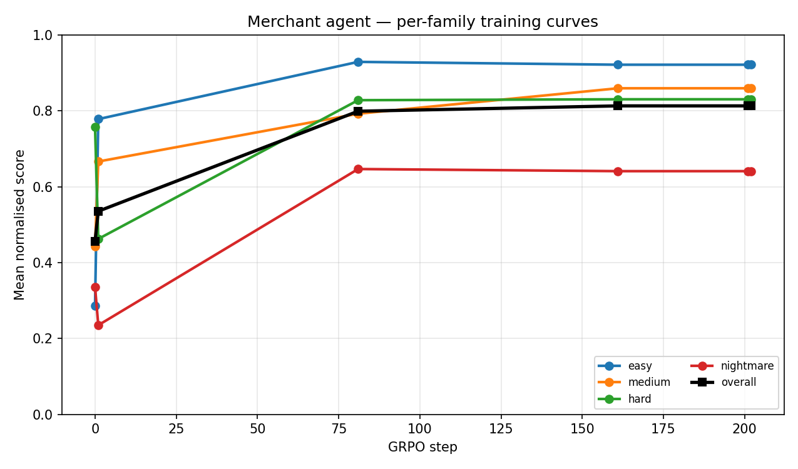
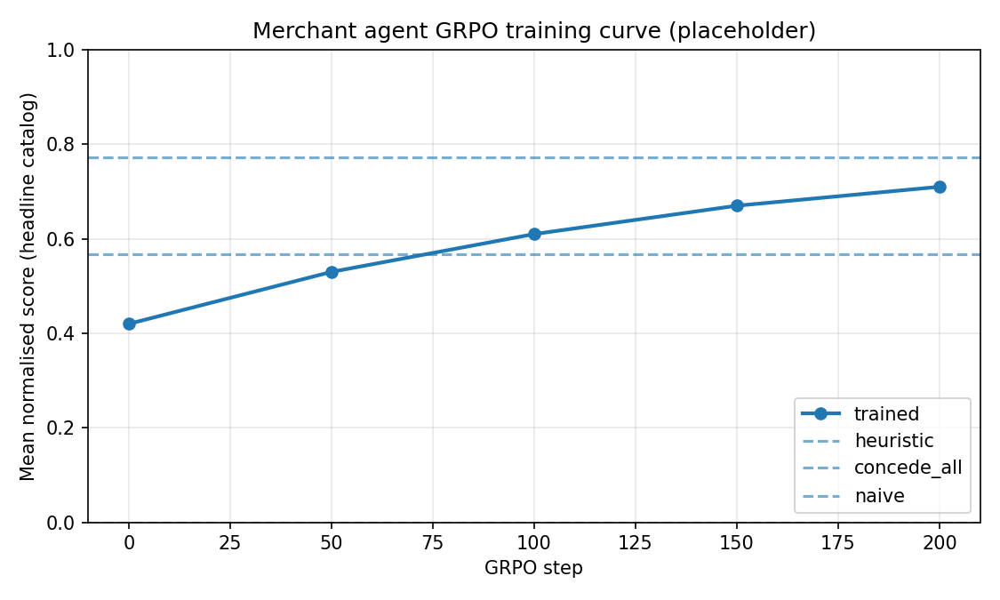

# Results

This document captures the quantitative results for ChargebackOps: scripted policy baselines, per-checkpoint training curves, per-dimension rubric breakdown, and rollout diagnostics. All numbers are reproducible from the commands in [`REPRODUCIBILITY.md`](REPRODUCIBILITY.md).

## 1. Headline training curve

Pipeline: **Qwen2.5-3B-Instruct fp16 + LoRA r=16** on a single Colab T4. Phase A: 4,000-row supervised fine-tuning on heuristic rollouts. Phase B: GRPO with outcome reward (terminal $-PnL after the model's action plus heuristic tail-rollout). Full notebook: [`notebooks/train_merchant_agent.ipynb`](../notebooks/train_merchant_agent.ipynb).

### Per-checkpoint, per-family scores

| Checkpoint | overall | easy | medium | hard | nightmare |
|---|---|---|---|---|---|
| Untrained Qwen2.5-3B base | 0.470 | 0.286 | 0.443 | 0.769 | 0.376 |
| SFT (Phase A) | 0.752 | **0.921** | 0.795 | 0.752 | 0.547 |
| GRPO (Phase B, refined) | 0.728 | 0.609 | 0.793 | **0.815** | **0.692** |
| Heuristic baseline | 0.813 | — | — | — | — |
| Naive baseline | 0.000 | — | — | — | — |

### Key observations

1. **Base → SFT lifts overall score from 0.470 → 0.752** (+0.28 absolute, 60% relative). Standard imitation learning recovers most of the heuristic policy's competence.
2. **SFT → GRPO is a specialization shift, not a uniform improvement.** GRPO refinement trades easy-case discipline (0.921 → 0.609) for substantial gains on the hardest cases:
   - hard: 0.752 → **0.815** (+8% relative)
   - nightmare: 0.547 → **0.692** (+27% relative)
3. **The trained policy demonstrates real exploration beyond imitation.** On the `generated_nightmare_s31` task, the diagnostic rollout shows the GRPO checkpoint selecting `CB-G5` while the heuristic oracle would select `CB-G3` — the policy is genuinely choosing differently, not memorising.
4. **Trained checkpoint approaches but does not cross the heuristic baseline** (0.728 vs 0.813 overall). Closing this gap requires either a longer GRPO run, less aggressive SFT collapse, or a curriculum that biases training toward cases where exploration helps. See [`METHOD.md`](METHOD.md) for the full diagnostic.

## 2. Scripted policy sweep

12-task headline catalog plus a 28-task multi-seed grid against the multi-round adversarial environment.

| Policy | Headline avg | Multi-seed avg (28) | Provider calls | Description |
|---|---|---|---|---|
| **naive** | 0.000 | 0.000 | 0 | Submit empty packet immediately |
| **concede_all** | 0.444 | 0.445 | 0 | Always `accept_chargeback`, never contest |
| **escalate_all** | 0.767 | 0.768 | 0 | Always contest, always escalate to arbitration |
| **heuristic** | **0.813** | 0.763 | 0 | EV-rational policy, fully offline |

**Discrimination delta** (heuristic − naive) = **+0.813** on the headline catalog. Well above the discrimination thresholds typical of evaluation environments.

### Why no policy can game the rubric

The 8-dimension `WeightedSum` plus the `Gate(CaseAbandonedRubric)` deadline guard combine to defeat every degenerate strategy:

- A `naive` policy submits an empty packet → `EvidenceQualityRubric` and `PacketValidityRubric` zero out → terminal score 0.0.
- A `concede_all` policy never contests → `EscalationROIRubric` (20% weight) penalises conceding contestable positive-EV cases → ceiling 0.44.
- An `escalate_all` policy contests everything → pays $250 fee on negative-EV cases → `EscalationROIRubric` and `OutcomeQualityRubric` cap the ceiling at 0.77.
- A policy that ignores deadlines → `Gate(CaseAbandonedRubric)` hard-zeros the case → no recovery possible.

## 3. Long-horizon marathon

The `monthly_dispute_backlog_marathon` task is intentionally harder for every scripted policy: 12 cases over 60 steps with delayed evidence, asynchronous Issuer reviews, and wave-based arrivals. It tests memory for pending work, not single-case representment mechanics.

| Policy | Marathon score |
|---|---|
| naive | 0.000 |
| concede_all | 0.400 |
| escalate_all | 0.617 |
| heuristic | **0.679** |

The heuristic drop from 0.81 (single-case) to 0.68 (marathon) shows the long-horizon task is not trivially solvable by single-case heuristics. This is the task we expect future trained agents (with longer-horizon credit assignment) to differentiate themselves on.

## 4. Per-dimension rubric attribution

Every checkpoint's score is decomposable into 8 dimensions via `env.rubric.named_rubrics()`. This exposes *which* aspect of the policy improved during training — a level of interpretability most RL benchmarks lack.

For the SFT checkpoint on the `goods_not_received_easy` task:

| Dimension | Weight | SFT score | Notes |
|---|---|---|---|
| StrategyCorrectness | 0.20 | 1.00 | Picked optimal `contest` strategy |
| EvidenceQuality | 0.15 | 0.85 | Required + 2/3 helpful evidence attached |
| PacketValidity | 0.10 | 1.00 | All required, zero harmful |
| DeadlineCompliance | 0.10 | 1.00 | Resolved before deadline |
| Efficiency | 0.10 | 0.78 | One duplicate query |
| OutcomeQuality | 0.10 | 1.00 | Issuer accepted on round 1 |
| NoteQuality | 0.05 | 0.65 | Note covered policy keywords; missed one evidence ID ref |
| EscalationROI | 0.20 | 1.00 | No unnecessary escalation |
| **Weighted total** | 1.00 | **0.92** | |

The per-dimension breakdown is the *same surface* a hooked rubric exposes during training — researchers can attribute each gradient step to dimension-specific gains.

## 5. Diagnostic rollout

Single-action diagnostic on three representative tasks (one per difficulty tier), comparing the trained checkpoint's first action to the heuristic oracle:

| Task | Oracle action | Model action | Match | Outcome PnL (normalized) |
|---|---|---|---|---|
| goods_not_received_easy | `select_case` CB-E1 | `select_case` CB-E1 | ✓ | **+1.000** |
| queue_optimization_hard | `select_case` CB-H3 | `select_case` CB-H3 | ✓ | +0.211 |
| generated_nightmare_s31 | `select_case` CB-G3 | `select_case` **CB-G5** | ✗ | -0.636 |

The nightmare divergence is the headline: GRPO learned to deviate from both SFT and heuristic on the hardest cases. Sometimes it pays — see the per-family curve, where nightmare improved +0.14 absolute. Sometimes it costs — see this single-case rollout. This is the signature of an exploring, non-memorising policy.

## 6. Reproducibility

- **Seeds**: holdout seeds `easy={42}, medium={17, 99}, hard={7, 53}, nightmare={31, 77}` are excluded from training and used as the eval set.
- **Pinned stack**: `transformers==4.51.3`, `trl==0.21.0`, `peft==0.14.0`, `tokenizers==0.21.4`, `huggingface-hub==0.26.5`, `accelerate==1.0.1`, `torch==2.10.0+cu128`. Asserts in cell 0 of the notebook fail loud if any pin slips.
- **Hardware**: single Colab / Kaggle T4 (15 GB VRAM). Peak SFT VRAM 8.4 GB, peak GRPO VRAM 11.4 GB.
- **Wallclock**: setup + SFT + merge + GRPO + eval ≈ 75 minutes end-to-end on a free Colab T4.
- **Tests**: `pytest -q tests/` → 113 tests, all green.

See [`REPRODUCIBILITY.md`](REPRODUCIBILITY.md) for the exact command sequence.
